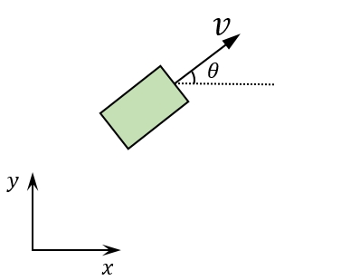

# 最优控制的基本概念

- 最优控制的基本概念
- 最优控制问题
- 性能指标选择

## 差速底盘模型

贯穿前后的一个模型，独轮车模型(类似于差速底盘)

<figure>
    
</figure>

小车在二维平面内行驶，状态变量有位置、速度、车头方向

$$
\boldsymbol{x(t)} = 
\left [ 
\begin{array}{c}
p_x (t) \\
p_y (t) \\ 
v(t) \\ 
\theta(t) \\ 
\end{array} 
\right ]
$$

此外定义系统输入，即控制量为加速度和旋转的角速度。

$$
\boldsymbol{u(t)} = 
\left [ 
\begin{array}{c}
\alpha(t) \\
\omega(t) \\ 
\end{array} 
\right ]
$$

这样就可以写出系统的状态空间方程

$$
\boldsymbol{\dot{x}(t)} = 
\left [ 
\begin{array}{c}
v(t) \cos \theta(t) \\
v(t) \sin \theta(t) \\ 
0 \\ 
0 \\ 
\end{array} 
\right ] + 
\left [ 
\begin{array}{c}
0 \\
0 \\ 
\alpha(t) \\ 
\omega(t) \\ 
\end{array} 
\right ] = 
f(\boldsymbol{x(t)}, \boldsymbol{u(t)})
$$

这个模型是一个多输入、非线性系统，含有三角函数和变量的乘积。并不好解。为了使用电脑求解，离散化一下

$$
\boldsymbol{\dot{x}}[k+1] = f_d [ \boldsymbol{x}[k], \boldsymbol{u}[k] ]
$$

基于此模型，分析一下机器人控制中的常见问题。

## 停车问题

<figure>
    
</figure>

初始状态为

$$
\boldsymbol{x_0} = 
\left [ 
\begin{array}{c}
p_{x0} \\
p_{y0} \\ 
v_0 \\ 
\theta_0 \\ 
\end{array} 
\right ]
$$

我们希望车在 $$ k =N $$ 时刻，能车头向 $$ x $$ 轴正方向停在指定位置，即目标状态为

$$
\boldsymbol{x_d} = 
\left [ 
\begin{array}{c}
p_{xd} \\
p_{yd} \\ 
0 \\ 
0 \\ 
\end{array} 
\right ]
$$

状态变量转化的过程是通过设计合适的 $$ \boldsymbol{u} $$ 来实现的。

在这种情况下，考虑什么是好的控制，我们希望最后停车完全停在框内，引入性能指标的概念。

$$
J = 
$$

