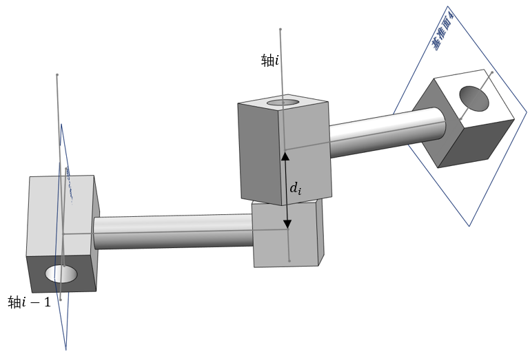
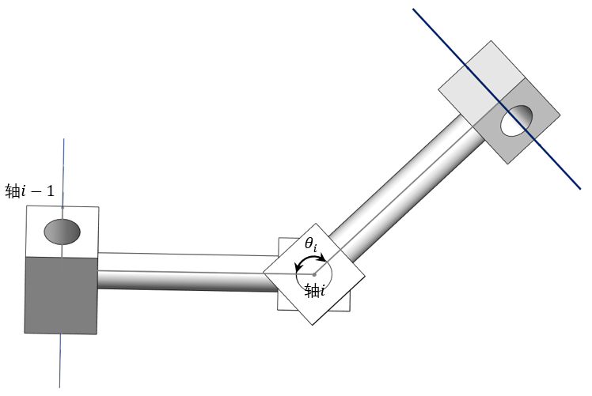
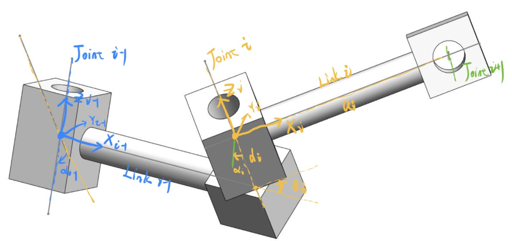
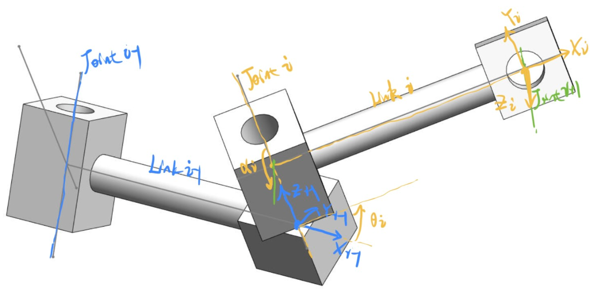
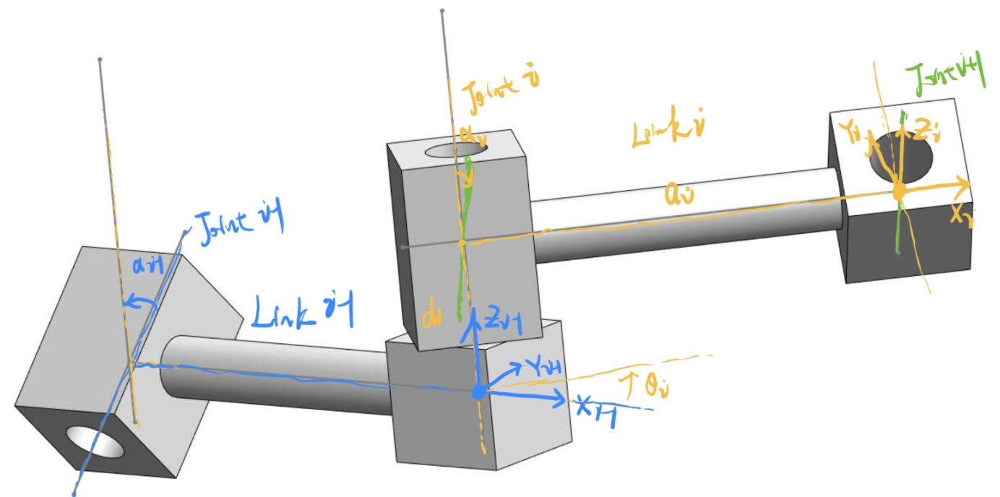

# Link Connection

有了前面对于空间和位置的描述，这里解决对机械臂本身空间位置描述的问题。在此基础上才能有运动学分析，即空间位置的数学关系描述。

## 单个连杆的参数

<figure>
    
    <figcaption>长度和扭转角</figcaption>
</figure>

- $$ \alpha_i $$ link twist ，连杆扭转角，两个轴的夹角
- $$ a_i $$ link length，连杆长度。两个轴的距离

## 相邻连杆的位置关系参数

每个轴有个坐标系统，从第1轴到第2轴会经过一个转换。所有轴，末端到地的一个转换关系

<figure>
    
    <figcaption>连杆偏距</figcaption>
</figure>

<figure>
    
    <figcaption>连杆关节角</figcaption>
</figure>

- $$ d_i $$ distance between 2 normals，两个 $$ x $$ 轴的距离，偏距
- $$ \theta_i $$ angle between 2 links ，关节转角，关节变量，其他的都是固定的。

## D-H 方法

Denavit-Hartenberg 方法。

机械臂的每个连杆都可以用上面的 4 个参数来描述。这就是 D-H 方法。

为了描述相对位置关系，干需要在每个连杆上定义坐标系。

## 连杆坐标系定义

连杆上放坐标系有很多种放法，可以放在头上，也可以放在尾部。这是两种最常见的放法。

不论哪种放法，z和x轴的选取都是一样的：
- z 为旋转轴
- x 沿公垂线方向指向下一轴

y轴按照右手系来选。

关节坐标系放在头部(靠近底座)，《机器人学导论》里的坐标系是这种放法，坐标系 $$ \{i\} $$ 固连与连杆 $$ i $$ (link i)，原点位于关节轴 $$ i $$。

<figure>
    
</figure>

关节坐标系放在尾部(靠近末端工具)，原点在关节轴 $$ i+1 $$

<figure>
    
</figure>

<figure>
    
</figure>

放在中间属于是吃力不讨好了。

关于坐标原点的选取：
- 当关节i轴线和关节i+1轴线相交时，取交点；
- 当关节i轴线和关节i+1轴线异面时，取两轴线的公垂线与关节i+1
轴线的交点；
- 当关节i轴线和关节i+1轴线平行时，取关节i+1轴线与关节i+2轴线
的公垂线与关节i+1轴线的交点；

不需要背，先看上面的图，找找感觉，然后再看文字描述。

DHmodel用了4个参数 $$ (a,d,\theta,\alpha) $$，旋转和伸长缩短都是 z 方向。

因此从一个轴到下一个轴，4步就能完成。

下一节找出这个数学关系。

