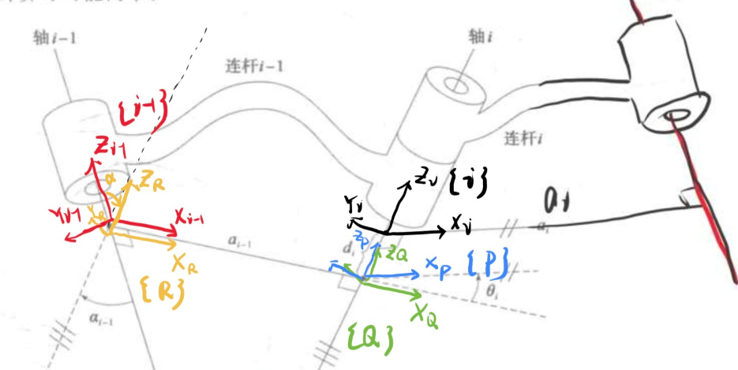
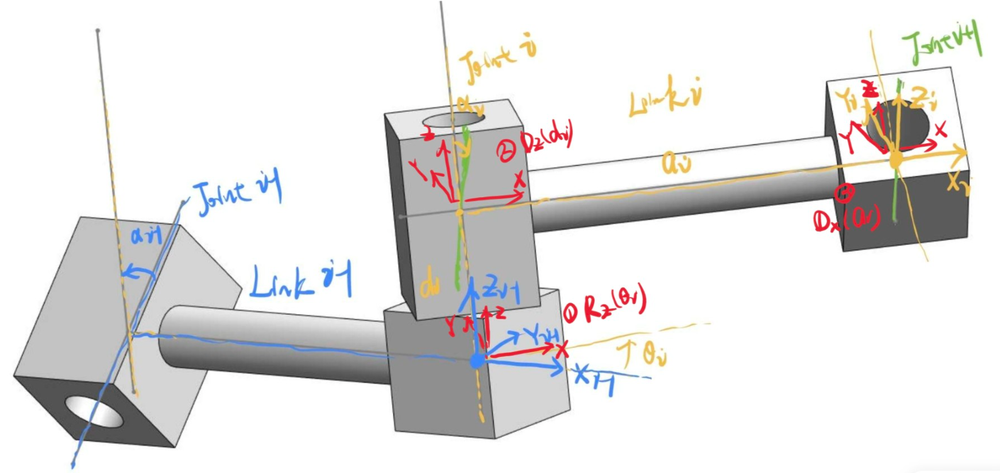
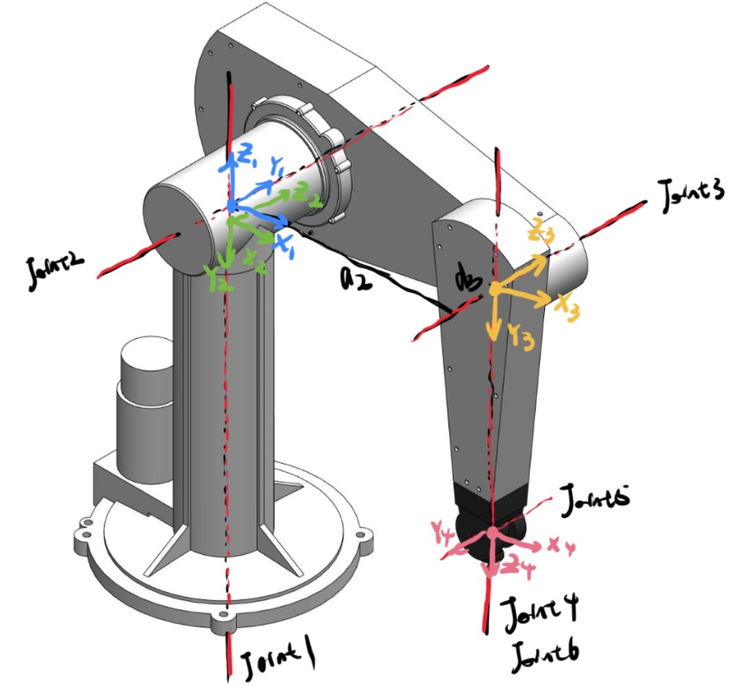
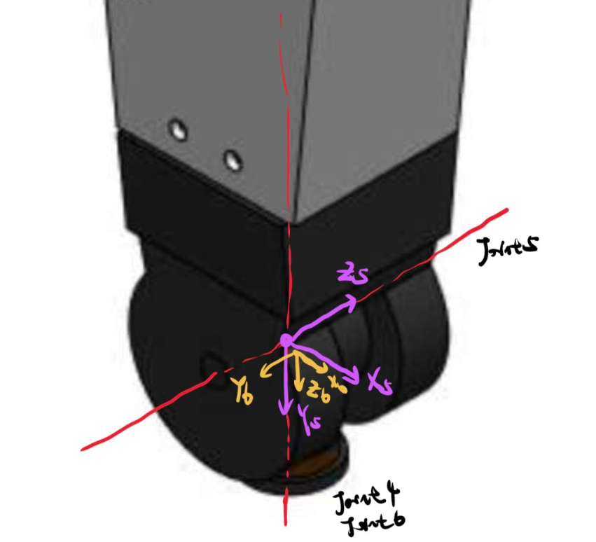

# 机械臂运动学

准备工作做好了，可以用数学运算来描述位置关系了。

首先推导相邻连杆坐标系变换的形式，然后就可以用复合变换求出机械臂末端相对于基座的位置了。

## 相邻连杆变换

也即如何从这个坐标系走到下一个坐标系，如何得到两坐标系之间的变换矩阵。

前面有两种坐标系的设置方式，这里也要分开讨论。

## 头部坐标系

坐标系固定在头部，《机器人学导论》的方式，使用书里的插图，

<figure>
    
</figure>

如图所示，即我们希望找出 $$ ^{i-1}_i T $$

为了解决这个问题，找出3个中间坐标系，每次只完成一个参数的变换，就可以推导出来了。

$$
^{i-1}p = \ ^{i-1}_R T  \ ^R_Q T  \ ^Q_P T \ ^P_i T \ ^{i}p
$$

复合变换用一个矩阵来表示

$$
^{i-1}p = \ ^{i-1}_i T \ ^{i}p
$$

按照前面的 4 步，这个变换实际上就是

$$
\ ^{i-1}_i T = R_X(\alpha_{i-1}) D_X(a_{i-1}) R_Z(\theta_i) D_Z(d_i) 
$$

```note

这个式子的理解方式，从前向后看，相对与当前位姿做操作，从后往前看，相对于世界参考坐标系。

```

使用前面的旋转矩阵和平移矩阵，乘起来就可以了，也很容易

$$
\ ^{i-1}_i T = 
\left [
    \begin{array}{}
        c\theta_i & -s\theta_i & 0 & a_{i-1} \\
        s\theta_i c\alpha_{i-1} & c\theta_i c\alpha_{i-1} & -s\alpha_{i-1} & -s\alpha_{i-1} d_i \\
        s\theta_i s\alpha_{i-1} & c\theta_i s\alpha_{i-1} & c\alpha_{i-1} & c\alpha_{i-1} d_i \\
        0 & 0 & 0 & 1 \\        
    \end{array}
\right ]
$$

这个是最一般的情况，4个参数都不为0。

连续变换就是把每个变换乘起来

$$
^0_N T = \ ^0_1 T * \ ^1_2 T * \ ^2_3 T\cdots * \ ^{N-1}_N T
$$

矩阵 $$ ^0_N T $$ 是关于 n 个关节变量的函数，只知道了每个关节的位置，机械臂末端在笛卡尔坐标系(笛卡尔空间)里的被指和姿态就能计算出来了。这就是正运动学。

## 尾部坐标系

对于坐标系固定在尾部，也是一样的想法，使用上一节的插图

<figure>
    
</figure>

红色为中间坐标系。这个变换顺序
- 绕 $$ Z_{i-1} $$ 旋转 $$ \theta_i $$
- 沿着 $$ Z_{i-1} $$ 移动 $$ d_i $$
- 沿着 $$ X $$ 移动 $$ a_i $$
- 绕 $$ X $$ 旋转 $$ \alpha_i $$

表达式为

$$
A_i = Rot(z, \theta_i) Trans(0,0,d_i) Trans(a_{i-1},0,0) Rot(x, \alpha_i)
$$

这里用了用一种符号，和前面的只是形式上的区别。

同样计算后为

$$
A_i = 
\left [
    \begin{array}{}
        c\theta_i & -s\theta_i c\alpha_{i-1} & s\theta_i s\alpha_{i-1} & a_{i-1} c\theta_i \\
        s\theta_i & c\theta_i c\alpha_{i-1} & -c\theta_i s\alpha_{i-1} & a_{i-1} s\theta_i \\
        0 & s\alpha_{i-1} & c\alpha_{i-1} & d_i \\
        0 & 0 & 0 & 1 \\        
    \end{array}
\right ]
$$


## 

上面的式子是最一般的情况，实际机械臂在设计的时候都是有讲究的。不论怎么设计，正运动学设计反正都是一路乘下去。但是要走回来就不容易。

比如关节的扭转角，一般都是0或者90

一般的工业机器人都会做成腕臂分离的形式，这样的设计也是从逆运动学考虑的，即 456 轴做成球形轴，不会有长度。

每个机器人都会有一个表，Kinematics Table，给出机器人的关节参数

| Joint | $$ \theta $$ | $$ d $$ | $$ a $$ | $$ \alpha $$ | Joint variable |
|-|-|-|-|-|-|
|||||||


## 空间

笛卡尔空间，3 维空间，也叫任务空间、操作空间，选定世界坐标系后，3 维向量表示。

关节空间，每个关节有一个转角，组成的 n 维向量。


## 运动学分析

坐标的定义并不是唯一的，最后达成目的就行，能精确的刻画最后的结果就可以，无所谓中间怎么定义。因此有些轴偏距并不是必须的。

<figure>
    
</figure>

<figure>
    
</figure>


## 坐标系的标准命名


