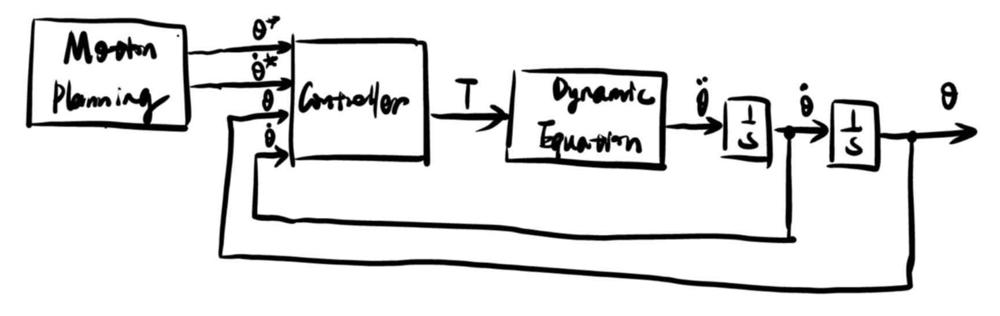

# 动力学

如果希望动画、演示的更真实一点，那么需要表现出质量或者惯量的感觉。

动力学的两个问题：
- 已知一个轨迹点，以及 $$ \theta , \dot{\theta}, \ddot{\theta} $$，希望知道关节力矩的大小
- 施加一组关节力矩，机械臂会如何运动

这部分的内容
- Lagragian Mechanics
- Newton-Euler Dynamic Formulation
- Dynamaic Simulator

运动是能量转换的过程，因此可以从能量的角度来理解运动，这就是拉格朗日的观点。

此外也可以直接看运动，力作用于物体产生加速度和角加速度。

这是考虑运动的两个观念。

上层的决策、规划给出每一目标点期望的关节转角、转速，通过控制器，给出合适的力矩。

<figure>
    
</figure>

