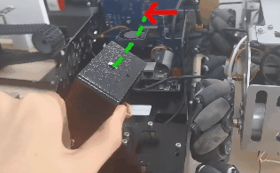

# 机械臂

# INTRODUCTION TO ROBOTICS

# 机器人学导论


工业机器人起源，第一步工业机器人，1961年，现在这个机器人还活着，在工作。

所以机械臂并不是一个新东西。


- Introduction
- Spatial Representation and Transformation 
- Kinematics and Inverse Kinematics
- Differential Relationship
- Motion Planning
- Dynamics
- Robot Control and Compliance

机器人的空间关系，多轴机器人，要知道每个轴的运动和以及最后到达位置的关系，因此每个轴都要放一个坐标系统。每个轴开始动，这些坐标系统在动的过程中就有变换的关系，transformation。这个解决后，针对机器人做运动学分析，到达目标位置各轴要摆出多少角度，或者说各轴给了各角度，末端会到什么位置。这些都是静态。

后面讨论微分，位置微分为速度，运动关系。一个机器人系统，比如车，四个轮子的速度和车的速度，这就是个运动关系，jaccobi关系，很重要，运动上的关系。对于运动的描述，同样也有正反两种。

有了这个之后，就可以规划一个路径了，有了路劲就有了空间里每个要到的点，以及每个轴要到的点的坐标，每个点在轴坐标的速度。

前面没有谈机器人的重量和质量，这里要加入动力学。让一个东西看起来像真的一样，比如说仿真如何看起来像真的一样，主要就在动力学仿真上。动力学很难描述，这也是仿真困难的地方

到这里机器人所有的东西都有了，就要做控制了，真正进入电控的部分。有了规划的路径，分析了每个轴的运动，速度和位置，电机推动，有质量，动作有没有到位，就靠控制器补偿，反馈控制。控制不仅仅有位置控制，要让机器人进入和环境交互的领域，就需要处理位置和力的关系，这样就可以夹取东西了。

工业机器人大概就是这么个样子。


## 参考书，概述

机器人学习入门书籍。

**工业机器人**或者叫做**机械臂**。

一台数控铣床不能叫机器人，区别大概是编程的复杂度。

- 第1章 概述
- 第2章 空间描述和变换
- 第3章 操作臂运动学
- 第4章 操作臂逆运动学
- 第5章 雅可比：速度和静力
- 第6章 操作臂动力学
- 第7章 轨迹生成
- 第8章 操作臂的机构设计
- 第9章 操作臂的线性控制
- 第10章 操作臂的非线性控制
- 第11章 操作臂的力控制
- 第12章 机器人编程语言及编程系统
- 第13章 离线编程系统


机械臂的运动学、动力学、轨迹生成、控制方法等。

空间描述和变换，把机械臂数字化的表示，坐标系的描述和转换，旋转的表示。

第3章，机械臂运动学建模和正运动学（根据关节角度推断末端姿态）推导。

第4章，逆运动学（根据末端姿态推断关节角度），存在多解问题，解析法和数值法

第5章，操作空间到关节空间的速度映射

上面是机械臂的运动学问题。接下来是动力学和控制的部分

动力学：牛顿-欧拉法，拉格朗日法，

轨迹生成，多项式轨迹

9-10，位置控制

力控制的方法，阻抗控制，力位混合等。


机械臂并不是一门新的学科，也不是单纯的把经典领域的东西拼凑在一起

- 机械工程师研究机器的静态和动态特性
- 数学家为描述空间运动和操作机械臂的其他属性设计了数学工具
- 控制理论提供设计和评估算法，来实现运动或力的控制
- 机械臂的传感器和接口设计需要电子电气技术
- 计算机科学提供了执行期望任务的编程平台

一些关键的概念的初步了解。

## 位置和姿态描述

机械臂需要去考虑在三维空间里的东西。“东西”包括机械臂本身和所处空间的其他物体。

物体用两个重要特性来描述：**位置**和**姿态**

位置的描述依赖于坐标系，姿态也是。为了描述一个物体的位姿，我们需要另一个参考的位姿。所以位姿的描述都是相对的。

既一般先在物体上设置一个坐标系（位姿），然后在其他参考坐标系里描述该位姿的位置和姿态。

任一位姿都可以当作参考坐标系用来研究物体的位置和姿态，因此经常要从一个位姿变换到另一个位姿。这其中有位姿的描述方法和数学计算方法需要解决。

## 机械臂正运动学

运动学研究物体运动，不考虑引起这种运动的力。

运动学里，研究**位置、速度、加速度**等，位置对于时间的高阶微分(位置对于其他变量也偶尔研究)。运动学研究运动的全部几何和时间特性。

机械臂是由**刚体**和**关节**连接。转动关节的位移为**关节角**。滑动关节的位置称为**关节偏移量**。

机械臂的**自由度**的个数是机械臂中有独立位置变量的数目。

机械臂运动链的自由端称为**末端执行器**，通常用设置在末端执行器上的**工具坐标系**来描述操作臂的位置。

**正运动学**是计算机械臂末端执行器位置和姿态的静态几何问题。给定一组关节角，计算工具坐标系相对于基坐标系的位置和姿态。即从**关节空间**描述到**笛卡尔空间**描述的机械臂位置表示。

```note
笛卡尔空间，用三个变量来描述空间一点的位置，另外三个变量描述物体的姿态，也称作任务空间或操作空间。
```

## 机械臂逆运动学

给定末端执行器的位置和姿态，计算所有可达到给定位置和姿态的关节角。这是机械臂实际应用中的一个基本问题。

这是个相当复杂的几何问题，人类每天要进行数千次这样的解答。

对于机器人系统，需要在计算机里设计一种算法实现这个计算，逆运动学求解是机械臂控制里最重要的因素。

这个过程把机器人位姿从三维**笛卡尔空间**向**关节空间**映射。

早期的机器人只能单纯的记录和再现关节位置和运动，就不需要任何变换算法，现在基本上都有这种算法了。

逆运动学不那么容易，其方程是非线性的，不好找到封闭解，有时候无解，同时还会遇到是否有解和多解问题。

运动学方程解的有无定义了机械臂的**工作空间**。无解就是到不了期望位置和姿态，因为目标在工作空间之外。

## 速度、静力、奇异点

除了静态定位的问题，还希望分析运动中的操作臂。

为机械臂定义**雅可比矩阵**可以比较方便的进行速度分析。雅可比矩阵定义了从*关节空间速度*向*笛卡尔空间速度*的映射。这种映射关系随着机械臂位置关系变化而变化，在**奇异点**，映射不可逆。

对于机械臂的设计者和用户来说，理解**奇异现象**很重要。

奇异现象的演示，二自由度云台，跟踪一个飞机，当飞机从头上飞过时，方位角的旋转速度就跟不上了，越接近头顶，绕方位轴转动的速度需要越快。如果飞机直接飞过头顶，那么就需要以无穷大的速度旋转。

<figure>
    
</figure>

任何一个只有两自由度的定位机构都会有这个问题，末端指向与方位角转轴共线，在这一点其中一个关节失效了，这种机构**局部退化**，就像只有一个自由度一样。

机械臂除了在工作空间运动，需要夹起物品时也会接触工件，并施加一个静力，这里还有个问题：如何设定关节力矩来产生要求的接触力和力矩。

为了解决这个问题，再次突出雅可比矩阵。

## 动力学

动力学研究产生运动需要的力，为了使机械臂从静止开始加速，使末端执行器以恒定的速度运动，最后减速停止，关节驱动器需要产生一组复杂的扭矩函数。

举个例子，人举起一个比预想的轻得多的物体，对负载的错误判断会引起异常的抓举动作。机械臂系统就是利用了质量以及其他动力学知识，在设计机械臂的运动控制算法时应该考虑进去这些东西。

动力学方程还有个重要的用途是**仿真**，重构动力学方程可以计算加速度，加速度是驱动力矩的函数。

## 轨迹生成

一条路径的描述不仅需要确定期望目标点，还要确定中间点或路径点，机械臂必须通过这条路径到达目标点。

为了让末端执行器走出一条直线，需要将末端执行器的期望运动转化为一些列等效的关节运动，这就是**笛卡尔轨迹生成**。

## 机械臂设计与传感器


## 线性位置控制


## 力控制

在工作空间运动时，需要位置控制，在接触物体时，需要力控制，时候后需要混合控制，比如擦玻璃的机器人，需要给毛巾点力，还需要在玻璃窗上运动。

## 机器人编程

编程语言是用户和机器人交流的接口。

## 一些符号

- 大写字母：矢量或矩阵
- 小写字母：标量
- 左上标或左下标 $$ ^A P $$ ：坐标系 $$ \{A\} $$ 中的位置矢量 $$ P $$
- 左上标左下标 $$ ^A_B R $$ ：确定坐标系 $$ \{A\} $$ 和 $$ \{B\} $$ 相对关系的旋转矩阵。
- 右上标 $$ R^{-1}, R^T $$ ：逆或转置
- 三角函数表示法 $$ \cos \theta_1 = c\theta_1 = c_1 $$


