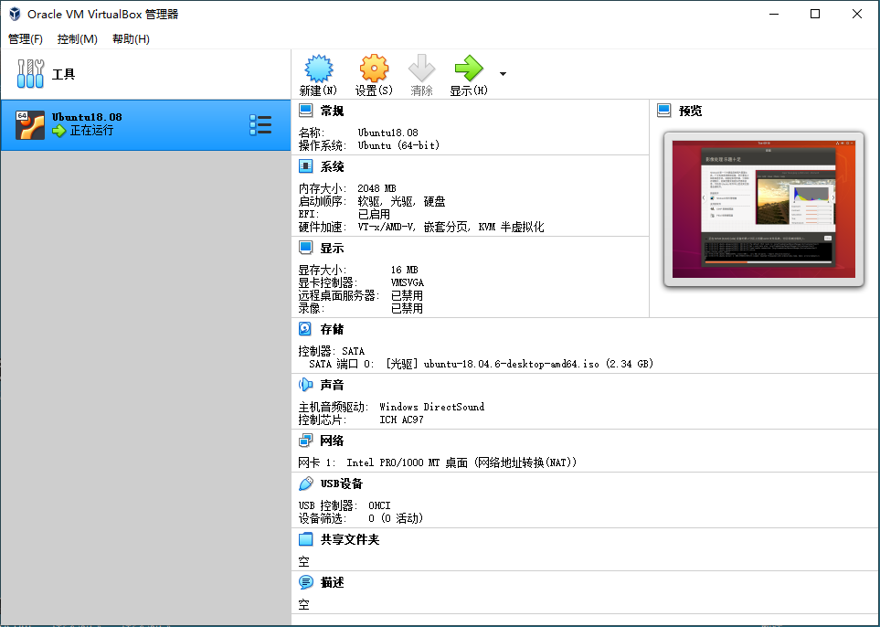

# Ubuntu 安装

## 实体机安装 Ubuntu 单系统


## 实体机安装 Windowns + Ubuntu 双系统


## VirtualBox 虚拟机安装 Ubuntu


## 移动介质上安装 Ubuntu

使用虚拟机在移动介质上安装，U盘接到虚拟机上，设置如下

<figure>
    
</figure>


把移动介质插到另一台电脑上时，需要修复一下引导。

引导修复

```bash
sudo add-apt-repository ppa:yannubuntu/boot-repair
apt-get update
apt-get install boot-repair
```
运行 boot-repair 自动修复引导，然后就可以启动了


