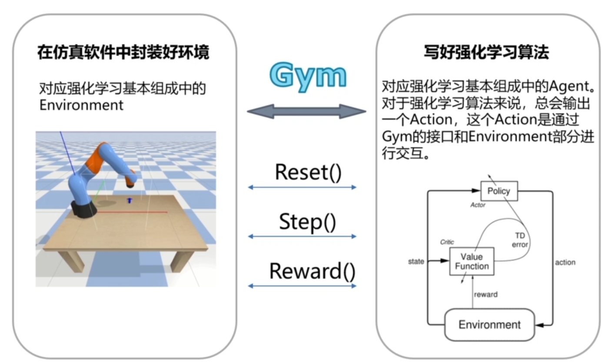
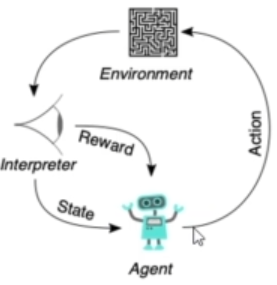

# 深度强化学习实现机械臂抓取

强化学习算法输入的有 state 和 visual 两种形式。

state ，智能体内部传感器的数据，visual 外部传感器的数据如相机。

visual 形式的输入更加难训练，网络参数更多，训练样本不足会过拟合。相关的前沿研究都在努力提高视觉输入的训练速度。

强化学习算法应用到了很多地方，比如游戏，自动驾驶，决策优化，推荐系统...。不同场景下，算法都是一样的，但是环境不一样

机械臂的环境，在仿真环境里封装，通过 gym 接口做强化学习算法的交互。游戏的话，使用网络通信的手段实现和算法的交互。

学习内容
- 强化学习
- 项目架构
- 搭建 pybullet 训练环境
- Spinup 库的 PPO 算法
- 训练和结果

强化学习，机器学习中的一个领域，

- 机器学习
  - 监督学习
    - 回归、分类、标记
  - 无监督学习
    - 聚类、主成分分析、生成对抗网络
  - 强化学习

这个话题比较热门，但是并不简单，门槛不低。强化学习不仅仅有强化学习本身的理论知识，还包含深度学习的知识。

整体的一个流程

<figure>
    
</figure>

大部分强化学习的任务，做好这几步基本上就能训练的起来。

<figure> 
    
</figure>

算法输出 Action，处理 State。

