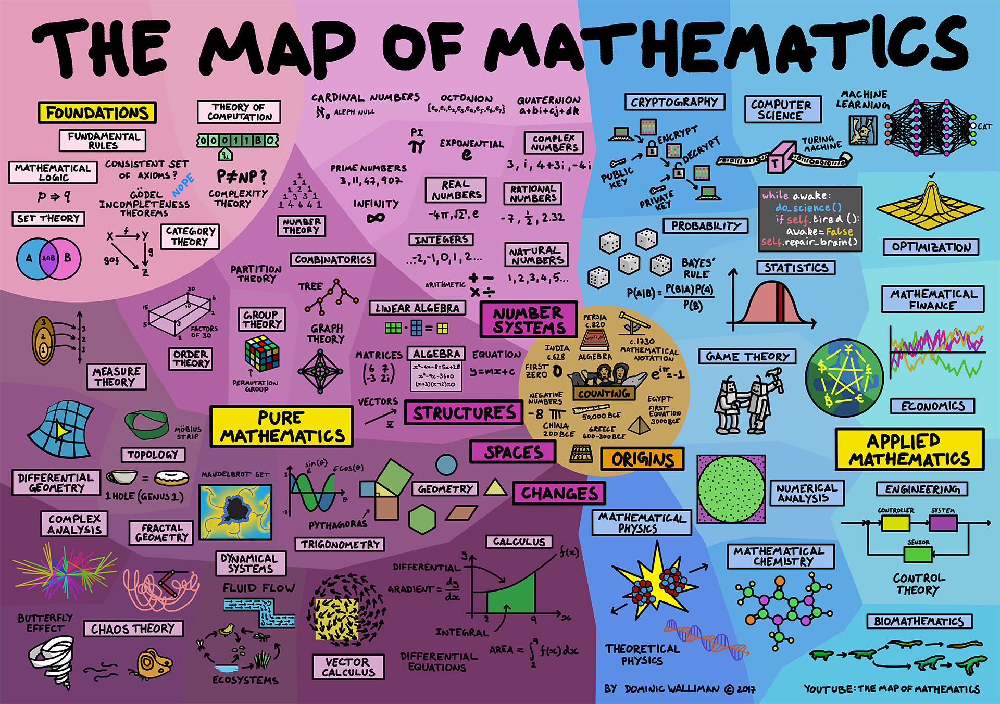
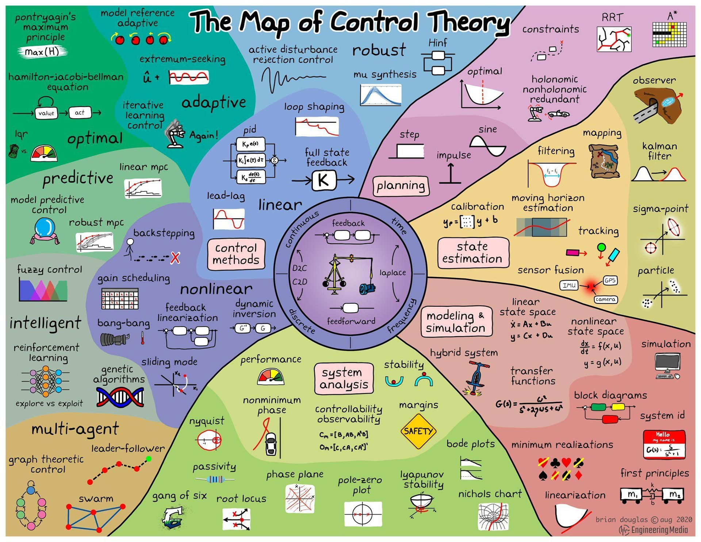
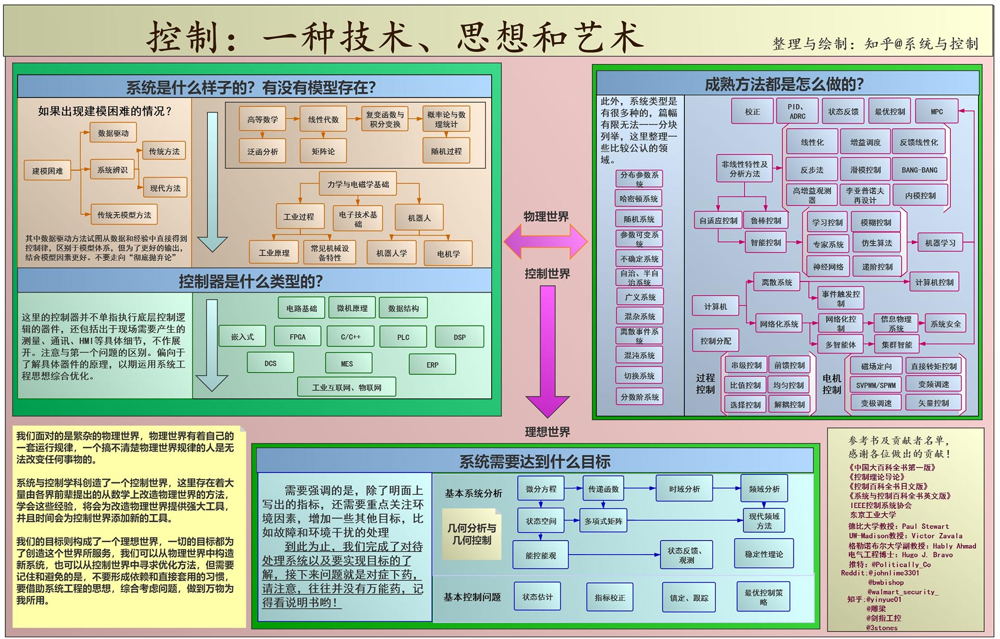

*感谢访问我的学习笔记。*

*如果是在GitHub看到这些内容，那么可以前往[独立网页](https://xu.yumeng.website/math)获得更好的浏览体验。*

*如果觉得我的笔记内容对您有帮助，那我会感到非常开心。*

最重要的

**如果我在内容上有理解错误，或者表达不严谨、符号不规范的地方，还请不吝指正。**

我的邮箱地址：[*m@njust.edu.cn*]()

或者扫描右侧二维码添加我的微信交流

---

这个笔记本将要整理的内容是以控制理论为核心的应用数学知识体系。

- [ ] 基础数学：微积分、代数学、概率统计、复变函数与积分变换；
- [ ] 从应用到数学：系统建模、动力系统、常微分方程；
- [x] 单入单出系统：线性系统经典控制理论；
- [x] 多入多出系统：线性系统状态空间理论；
- [x] 非线性系统：系统稳定性、基本分析方法、控制方法；
- [ ] 计算机控制：离散系分析

---

## 简单介绍

数学是个比较头疼的东西，这个东西过于严谨和理性，它虽然源自于物理世界的实际问题，但是却可以脱离物理世界建立一套抽象并且自洽的逻辑。

探索是一个有趣的过程，一个定理的发现和证明往往需要耗费数学家们巨大的时间。但是在上课学习过程中，为了教和学的效率，需要直接面对一个巨大而且抽象的数学体系，我觉得学习数学感到痛苦的根源就来自于抽象。

因此在整理这些数学知识时，我尝试从物理世界出发，从工程的具体问题作为切入点，由“工程-理论-工程”的顺序，即“具体-抽象-具体”方式进行整理。第一个具体作为抽象知识的直观理解方式，在理解了抽象知识后，第二个具体则是对抽象数学知识在不同领域的应用，这也对应了这个笔记本的标题《工程中的数学》。

## 数学大厦的模糊样子

数学这个话题比控制理论更加广泛，控制理论可以认为是应用数学的一个分支，在学习控制理论前，了解一下数学大厦大概是个什么样子是有必要的，虽然我也不大可能都学完，但是在实际问题中需要用到某些数学方法的会有个大概方向。

<figure>
    
    <figcaption>The Map of Mathematics</figcaption>
</figure>

这张图来自Youtube博主[DoS - Domain of Science](https://www.youtube.com/channel/UCxqAWLTk1CmBvZFPzeZMd9A)，B站有双语搬运的视频[The Map of Mathematics](https://www.bilibili.com/video/BV1Ff4y1R7B7?from=search&seid=1405116911122618004)。

现代数学分成两大块：基础数学和应用数学。基础数学在研究数学自己，应用数学是为了解决实际问题。基础数学和应用数学并没有严格界限，历史上有过有人出于纯好奇研究一个数学分支开拓了新领域，在当时毫无用处（属于基础数学😂😂），但是过了几百年后忽然发现这些古老的理论却可以解决现在的问题。一个典型的例子是复数在交流电之前出现。

一些极为抽象地东西却莫名其妙的有用，这就是数学的威力。

基础数学从数字(number system)出发，自然数、整数、分数、有理数、实数、复数，数字有各种性质比如说实数集和整数集都包含无穷个元素，但是实数集要比整数集大，即便是无穷也是可以比出大小的。为了研究数的结构，就要把数字带入方程的变量中，人们可以用向量、矩阵处理这些方程，向量矩阵由多维数字组成，他们的运算规则在线性代数里有介绍。数论(number theory)研究的是数字的性质，离散数学则关注特定的数理结构比如搜索树、决策树、最短路、网络流，他们的组成是离散的，可以计数。群论(group theory)的重点是群之间的关系，比如魔方就是个置换群。序理论(order theory)研究在特定规则下排序比如大小关系，自然数就是个有序集。基础数学还有一部分是研究形状和它们在空间的表现，人类很早就开始研究几何了，比如勾股定理与三角函数，除了这些还有更有意思的，分形几何研究无限复杂具备自相似结构的几何学，拓扑学(topology)则关注另一些特性，不停改变形状但不撕开或粘上，如莫比乌斯环只有一边一面。测度论(measure theory)可以为空间和集合赋值，将数字和空间联系起来。最后微分几何研究曲面上形状的特性比如曲面三角形的角度会变化。微积分在研究变化，矢量微积分和微积分的思路差不多。动力系统在研究系统状态的时变特性，混沌论也研究动力系统，但对初始条件更加敏感。复变分析研究的是复函数的性质。

上面有些东西看似是应用数学，事实上，这些领域的交叉程度极高，这里强行做了分割。纯数学和应用数学是连成网络的。

物理几乎将上面讲到的数学全都用上了，数学物理和理论物理都和基础数学有联系。其他学科也和数学有紧密联系，比如数学化学、生物数学，他们研究从分子建模到生物进化。数学上在工程里大放异彩，复杂控制系统要用到动力系统方法，或者说控制论。对于一些无法准确求解的东西，数值分析帮了大忙，或者用简单近似去得到一个合适的结果，这也是典型的工程思维。博弈论在经济学中有应用。概率论则研究随机事件，往往和统计学走的比较近，这些内容也很多出现在经济学中。数理金融为经济系统建模，然后求解最优值，割韭菜，这就不得不提优化理论。优化理论在诸多限制和选项里计算出最佳方案，也可以简单认为是在求解函数最值，把更少的钱花的更加快乐就是个优化问题。在计算机这个巨大领域，数学也随处可见，线性代数、优化理论、动力系统、概率论，密码学。

数学和工程共同向前发展的同时，基础数学还想找出数学本身的性质(foundations, fundamental rules)，是否有一套完备的规则、公理，可以推导任何数学分支并且自洽，把抽象给他抽象出来。数理逻辑、集合论、范畴论都有过尝试，有点哲学的意思了。数理逻辑的一个著名结论：哥德尔不完备定理，数学并不存在一套完备自洽的公理，或者说数学就是我们编出来的😂，看起来诡异，因为数学已经解决宇宙中的好多问题了，编出来的东西怎么会做到呢？

这大概就是数学大厦一个模糊的样子。

数学这种在一个点上卡了很久突然顿悟的感觉，有一种掌握真理错觉。某些时候灵光一现想通了某个定理，仿佛发现了世界的本质，学习数学时候的这种感觉还是很不错的，只是数学这个东西实在是不太好学习。

## 控制理论与控制工程的大厦

控制来源于工程，数学分析方法的应用使控制得到升华。大概清楚了控制理论在数学体系里的位置，还要再看看完整控制理论大概的轮廓，控制与基础数学的联系以及控制理论与控制工程的联系。

最开始的The Map of Mathematics里，控制理论缩在一个小角落，画了一个典型的反馈控制框图代表了这些内容，现在把这部分展开按照领域画出[the map of control theory](https://www.youtube.com/channel/UCq0imsn84ShAe9PBOFnoIrg)：

<figure>
    
</figure>

关于更加细节的介绍，单独有个部分做控制理论的科普

控制理论就是用在工程里的数学，因此这张图也更全面的展示了控制理论与控制工程的脉络。

<figure>
    
</figure>

从控制工程师设计一个控制系统的角度来看，控制理论、控制工程、控制方法之间的联系：

<figure>
    
</figure>

控制理论几乎可以认为是数学上的问题，研究控制理论的人几乎都很偏执的要用数学手段推导出一个系统最终是趋于稳定的，比如微分方程的稳定性，最优问题，泛函之类的。

控制工程比较庞大杂乱。好多时候还没来得及上升到应用控制理论，在硬件电路板上就先出问题了。

所以也能看出，坚实可靠、性能优秀的硬件是应用优秀控制理论（方法）的基础，好的控制方法更像是是锦上添花，不是雪中送炭。就比如说做自动控制小车，每天开关一开电路板就冒烟，电容就放炮，哪还有机会去搞控制方法。智能车比赛就是这样的，好的稳定的硬件，就简单的PID就能拿奖了。好的稳定的硬件，在加上各种阿克曼模型，上升到数学的角度，再设计一个精妙的中断嵌套，去考虑各种情况，或者整一个小操作系统，可以拿一个不错的奖。所以智能车这个东西下限不高但是上限很高。初高中玩的编程启蒙智能车到华为的自动驾驶汽车中间还是有很大的距离的。上学的时候我就发现一个很有意思的事情，各种控制方法，仿真的时候跑的好好的，一搞实物了，和仿真不能说是关系不大，简直就是毫无关系另起炉灶。典型的倒立摆的MATLAB仿真和真自己搞一个倒立摆。 毕竟工程中的问题太多了，要控制倒立摆，首先得有个可以控制力矩的电机，差不多点的都是BLDC，PMSM也有，要是想自己做，FOC得懂吧，最起码调个ST的库吧，单片机软硬件得懂吧，最起码抄一个三相驱动板。传感器得有吧，旋转编码器或者高端一点的IMU，IMU的话滤波得会吧，最起码那几个公式不懂，再调个库，这个滤波不是取平均值那个滤波，是卡尔曼滤波那个。 这些东西，每个都是一条腿，一个凳子四条腿，控制工程师坐在凳子上做PID，但凡少了一条腿，控制工程师有一肚子本事也使不出来。 这也导致很多小公司意识不到学控制的人的作用，我以前那个公司就是，搞机械的人顺便在做控制，然后就怎么说呢，五花八门吧。当然也是可以理解的，毕竟人力成本也是成本，能省就省了，做的产品也不需要单独有个控制工程师的程度。

所以一些比较厉害的控制项目，居然是一个人完成的，这个事情觉得很不可思议但是又很合理，毕竟每个环节自己把控的都很放心。也没有喜闻乐见的硬件、软件、算法团队之间扯皮甩锅环节，一定程度上讲工作效率甚至还会提高，在工作的时候需求都提不明白，倒是也不能怪提需求的人，这是一个出题和解题的过程，只不过出题的人不是专业课老师罢了，这也要求做项目的人怎么通俗的表达自己的想法。比如以前做的一个ROS无人车，这个东西谈不上自动驾驶的范畴，最多算是轮式移动机器人，当然一定要说是自动驾驶也倒是勉强可以接受，客户提需求说你搞自动驾驶，那整一个北斗导航系统呗。我想解释，但是想想还是算了，毕竟我们搞的东西只是个IMU+里程计，激光雷达的一个融合定位的东西，slam建图以后来的全局+局部路径规划，然后做一个底盘的轨迹跟踪控制。在客户看起来这不就是卫星定位知道位置然后自己跑嘛，结果是一样的，甚至他这个方案努努力好像也能整一个出来。写这个倒不是说嘲讽客户不懂，他懂了要我干嘛，我还指望靠我懂的这些吃饭呢。写这个警醒我自己将来在做项目顶层设计的时候，在自己不是很专业的领域不要想当然的去做，多找找专业的人，多看看成熟的方案是怎么做的，想想为什么这么做。

所以学自动化的同学在学控制理论的同时不得不学搭建平台的东西。

做控制有一种从上往下看的感觉，一个控制框图，我要达到这个控制效果，需要什么硬件，每个硬件需要什么精度回来什么数据，回来的数据干什么，都是在设计这个系统的时候就已经知道的。不是专业做控制的是有时候从下往上做（这个时期我也经历过），先有了硬件，然后回来一堆数据傻眼了，别人问我为什么要有这个硬件，我说我看别人成熟的东西有...我也整一个。

## 参考资料

这部分主要还是侧重控制理论中用到的数学基础。

- 知乎专栏，航空工程师J Pan[透彻的数学](https://zhuanlan.zhihu.com/p/57764200)
- 中科院物理所公众号[MIT牛人解说数学体系](https://mp.weixin.qq.com/s?__biz=MzAwNTA5NTYxOA==&mid=400856341&idx=1&sn=f5e417b3f67efd872afa41e321460501&scene=21#wechat_redirect)

