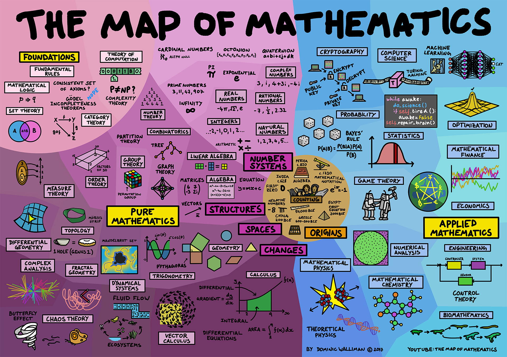
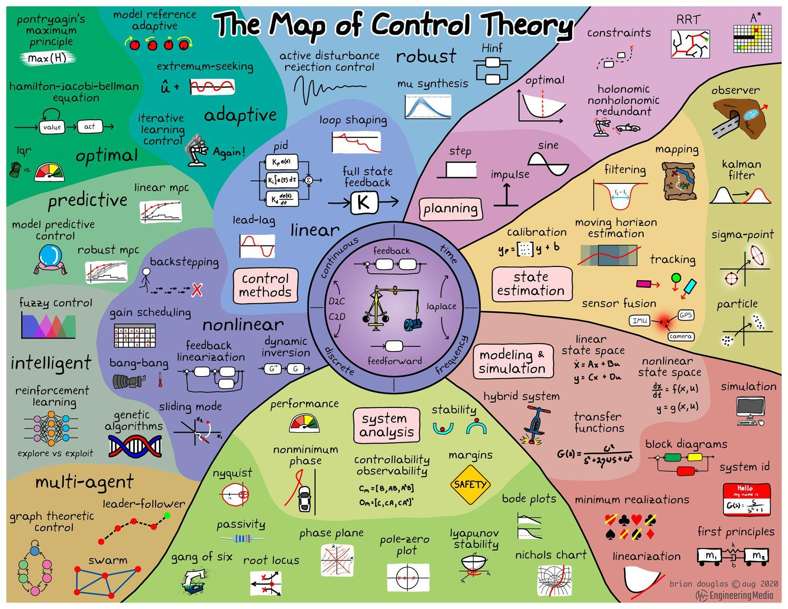
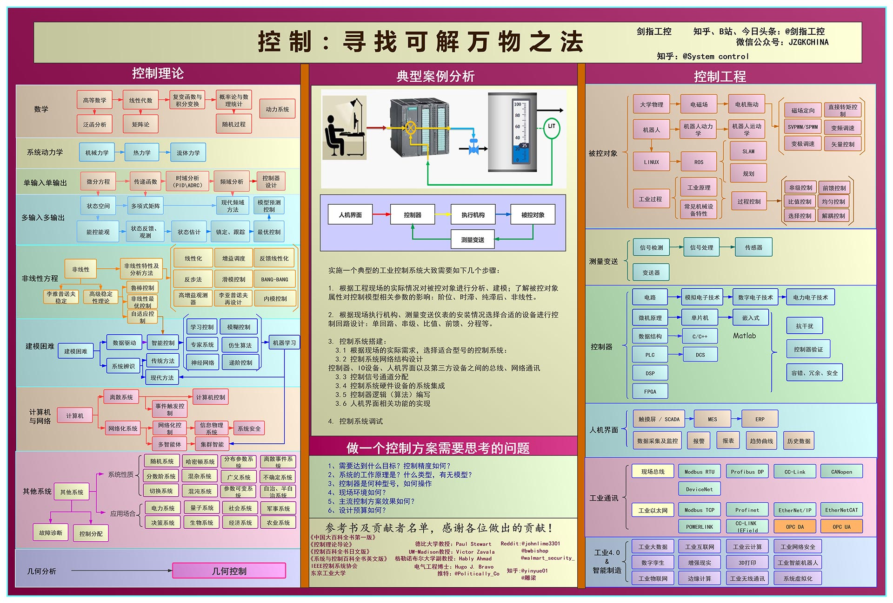
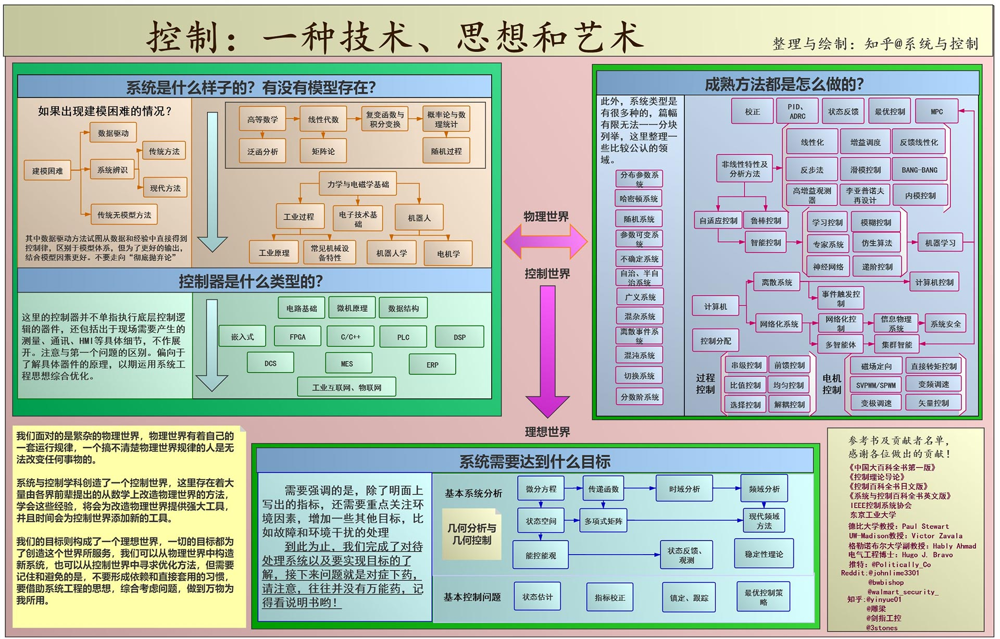
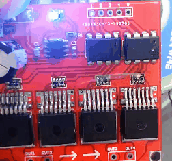

# 机器人控制中的数学基础

---

*感谢访问我的学习笔记。*

*如果是在GitHub看到这些内容，那么可以前往[独立网页](https://control.xym.work)获得更好的浏览体验。*

*如果觉得我的笔记内容对您有帮助，那我会感到非常开心。*

最重要的**如果我在内容上有理解错误，或者表达不严谨，还请不吝指正。**

我的联系方式(微信/QQ)请查看[个人主页](https://xym.work)，欢迎朋友们互相交流、一起学习。

---

## 这个笔记在做什么？

这是一个围绕 控制理论、机器人系统与工程实现 的学习笔记。

最初整理这些内容，是因为在学习和实践控制工程时，经常会遇到两个问题：
- 1. 数学体系庞大而抽象，不容易理解它与工程之间的关系
- 2. 控制理论、机器人技术、软件系统之间的联系并不直观

因此这个笔记尝试回答一个问题：

如何从工程视角理解控制理论与机器人系统？

整个笔记的整理思路大致是：

工程问题 → 数学抽象 → 工程实现

也可以理解为：

具体 → 抽象 → 再具体

希望通过这种方式，将数学、控制理论和机器人开发联系起来。

## 笔记内容结构

目前计划整理的内容包括：

- [ ] 数学基础：微积分、线性代数、概率统计、复变函数与积分变换、常微分方程；
- [ ] 控制理论基础：经典控制理论、离散系统、非线性初步初步、状态空间理论初步
- [ ] 数学进阶：矩阵分析、泛函分析、优化理论、数值分析
- [ ] 控制理论进阶：线性系统理论、最优控制、状态估计
- [ ] 机器人学：空间描述与坐标变换，正逆运动学，雅可比矩阵，机械臂动力学，轨迹生成，机械臂控制
- [ ] 自主移动机器人：运动学、运动控制，感知、定位、规划、导航初步
- [ ] 机器人开发相关技术：仿真工具 如 webots，ROS, ROS2
- [ ] 工程实践

## 修改记录

- 2024-08-15 整体迁移到 gitbook 平台，添加了机器人控制的内容
- 2026-03-10 感谢公众号 `1024robot` 推送。首页介绍整理(GPT 辅助)，整体思路不变，内容表述更严谨

## 数学与工程

数学的一个有趣之处在于：它来源于现实世界的问题，但在发展过程中逐渐脱离具体问题，建立起高度抽象且自洽的逻辑体系。

例如 1 + 1 = 2。当我们看到这个等式时，不会再想到 `一根手指加另一根手指` 或者 `一块钱加一块钱`。这些具体的情境在学习早期帮助我们理解数量，而在之后的学习中，我们逐渐接受了“数字运算”这种更加抽象的概念。

在更高层的数学中，这种抽象会继续发展。例如矩阵乘法从数学上讲表示一系列线性变换。实际情景中可以是多个旋转或多次坐标变换。

这种抽象带来的问题就是：学习数学往往很痛苦。

在工程实践中，我们往往先遇到问题，再去寻找数学工具解决问题。而在数学课程中，通常是先学习抽象理论，再寻找应用场景。这种顺序上的差异，往往是学习困难的来源之一。

因此在这个笔记中，我尝试从工程问题出发理解数学。不过在进入具体问题之前，仍然有必要先了解一下数学体系的大致结构，以及控制理论在其中所处的位置。

数学的范围比控制理论更加广泛，控制理论通常被认为是应用数学的一个重要分支。因此，在学习控制理论之前，对整个数学体系有一个大致的认识是有帮助的。当然数学体系极其庞大，不可能全部系统学习。但如果能够了解各个主要领域的大致内容，在工程实践中需要某种数学工具时，至少能够知道应该从哪里寻找。

<figure>
    
    <figcaption>The Map of Mathematics</figcaption>
</figure>

这张图来自 YouTube 博主[DoS - Domain of Science](https://www.youtube.com/channel/UCxqAWLTk1CmBvZFPzeZMd9A)，B站有双语搬运的视频[The Map of Mathematics](https://www.bilibili.com/video/BV1Ff4y1R7B7?from=search&seid=1405116911122618004)。

现代数学可以粗略分为两个大的方向：基础数学(pure mathematics)和应用数学(applied mathematics)。基础数学主要研究数学自身的结构，而应用数学则更多关注现实问题的建模与求解。二者之间并没有严格界限。在数学史上，很多研究最初只是出于纯粹的好奇心，探索某些抽象结构，在当时毫无用处。但是过了几百年后忽然发现这些古老的理论却可以解决现在的问题。一个经典例子就是**复数**(complex numbers)在交流电理论中的应用。

一些看起来极为抽象的理论，会在意想不到的地方发挥作用，这也是数学的魅力之一。

基础数学如果从比较直观的角度去看，可以先从“数”开始理解：从自然数(natural numbers)、整数(integers)，到有理数(rational numbers)、实数(real numbers)、复数。数本身就有许多有趣的性质，例如实数集和整数集都包含无穷多个元素，但它们的“大小”并不相同。即便同样是无穷，也仍然可以比较。

当人们开始研究多个量之间的关系时，就会遇到方程与方程组(systems of equations)，而向量和矩阵正是描述和处理这些关系的重要工具，这些内容构成了线性代数(linear algebra)的核心部分。数论(number theory)主要研究整数及其性质；离散数学(discrete mathematics)关注逻辑、集合、关系、图、组合等离散结构，这些内容也广泛出现在计算机科学中。

除了“数”，数学还研究“形状”和“空间”。几何学(geometry)很早就进入了人类知识体系，从勾股定理到三角函数都属于这一脉络。继续向更抽象的方向发展，还会遇到拓扑学(topology)、微分几何(differential geometry)、测度论(measure theory)等内容：拓扑学关心的是形状在连续变化下保持不变的性质，微分几何研究曲线、曲面以及更一般空间上的几何性质，而测度论则尝试把长度、面积、体积这类“大小”概念推广到更一般的集合与空间中。

数学也研究“变化”。微积分研究连续变化(calculus)，动力系统(dynamical systems)研究系统状态随时间如何演化，混沌现象则揭示了某些系统对初始条件的高度敏感。复变分析(complex analysis)研究复函数的性质，这些内容后来也都在物理和工程中找到了广泛应用。

当然，上面这种划分只是为了方便理解。不同数学分支之间的交叉其实非常广泛，纯数学和应用数学也并不是彼此割裂的，而更像是一张相互连接的网络。

数学不仅研究自身，也深度参与对现实世界的建模。物理几乎用到了大量核心数学工具；工程中的控制系统离不开微分方程(differential equations)、线性代数、动力系统和优化方法(optimization methods)；对于一些无法准确求解的东西，数值分析(numerical analysis)帮了大忙，或者用简单近似(展开丢高阶项)去得到一个合适的结果，这也是典型的工程思维；经济学中常见概率论(probability theory)、统计学(statistics)、博弈论(game theory)与优化，为经济系统建模然后求最优值去更好的割韭菜(德州扑克，零和博弈)；优化理论则在诸多限制和选项里计算出最佳方案，(可以简单理论成求函数最值，如何把更少的钱花的更加快乐，最优化控制)；计算机领域则同样离不开离散数学、线性代数、概率论、优化理论与密码学(cryptography)。

在这些具体应用不断发展的同时，数学家也一直在追问：数学本身的基础(foundations, fundamental rules)是什么？是否存在一套足够完备且自洽的规则，可以推导出整个数学体系？围绕这些问题，集合论(set theory)、数理逻辑(mathematical logic)等基础性研究逐渐发展起来。数理逻辑中的一个著名结果是[哥德尔不完备定理(Gödel’s incompleteness theorems)](https://zh.wikipedia.org/wiki/%E5%93%A5%E5%BE%B7%E5%B0%94%E4%B8%8D%E5%AE%8C%E5%A4%87%E5%AE%9A%E7%90%86)：对于足够强的形式系统，如果它是一致的，那么它就不可能是完备的。简单粗暴的说，数学就是我们编出来的😂。这会让人产生一种很奇妙的感觉：数学一方面像是人构造出来的抽象体系，另一方面却又能如此有效地描述现实世界。而且我们已经靠这种编出来的理论，把航天器送上天探索宇宙了。

这大概就是数学大厦一个模糊的样子。

数学学习中最奇妙的体验之一，就是在某个问题上卡了很久之后突然顿悟(数手指进化到 1 + 1 的那个时刻)。那一瞬间会让人产生一种仿佛掌握了某种深层规律的错觉。某些定理想通的时候，甚至会有一种“自己碰到了世界本质”的感觉。这种感觉还是很不错的，只是数学这个东西实在是不太好学习。

## 控制理论与控制工程

控制理论可以看作数学方法在工程系统中的集中应用。要理解控制理论，除了看它在数学体系中的位置，还要看它与基础数学的联系，以及它和控制工程之间的区别与联系。

最开始的 The Map of Mathematics 里，控制理论缩在右下角的角落，画了一个典型的反馈控制框图代表了这些内容，若把这一小块继续展开，就会得到更完整的[the map of control theory](https://www.youtube.com/channel/UCq0imsn84ShAe9PBOFnoIrg)：

<figure>
    
</figure>

下面这张图也更全面的展示了控制理论与控制工程的脉络。

<figure>
    
</figure>

从控制工程师设计一个控制系统的角度来看，控制理论、控制工程、控制方法之间的联系：

<figure>
    
</figure>

控制理论在很大程度上是一个数学问题。它关心的是如何对系统进行建模、分析与设计，并尽可能用严格的数学手段说明系统为什么稳定、性能为什么满足要求。比如在线性系统、非线性系统和微分方程理论中，稳定性分析就是一个核心问题。研究控制理论的人也都**很偏执的要用数学手段推导出一个系统最终是趋于稳定**的

但控制工程就远比控制理论庞大和杂乱。很多时候，问题甚至还没来得及上升到“控制方法是否先进”这个层面，系统就已经先在硬件、电源、驱动、传感器、采样或执行机构上出问题了。

所以也能看出，坚实可靠、性能稳定的硬件，是控制方法发挥作用的基础。很多时候，优秀的控制算法更像是在一个已经“站得住”的系统上继续提升性能，而不是凭空拯救一个本身就不稳定、不可控、不可测的系统（锦上添花，不是雪中送炭）。

例如自动化专业工程入门第一课自动控制小车，如果每天一上电电路板就冒烟电容放炮，传感器数据乱跳，执行器也不受控，那自然没有机会去认真讨论控制方法。反过来，如果硬件可靠、执行器和传感器都比较稳定，那么哪怕只是简单的 PID，也可能已经取得不错的效果。再往上，才轮得到车辆模型(差速 or 阿克曼)、轨迹规划、轨迹跟踪、状态估计、任务调度这些更复杂的内容。所以智能小车这个方向，下限并不高，但上限其实非常高：从编程启蒙小车到自动驾驶，中间隔着的是一整套完整系统工程。

<figure>
    
</figure>

我在学生时代就很明显地感受到：很多控制方法在仿真里跑得很好，一上实物却常常像是另起炉灶。仿真里的系统往往干净、连续、参数明确，而真实系统里却充满了摩擦、间隙、噪声、时延、饱和、采样误差、装配误差以及各种硬件限制。典型的例子就是倒立摆：MATLAB 里用 simulink 做一个控制演示不算难，但真要自己搭一个能稳定工作的倒立摆，背后涉及电机、驱动、传感器、结构设计、实时控制和软件实现，完全是另一层难度。

>如果电机也自己做，这也是一个完整的控制系统，BLDC PMSM，ST 的库或者开源的 simpleFOC，电机控制想做好也挺不容易的。

这些环节每一个都像是控制系统的一条腿。执行器、传感器、驱动、电源、软件架构、实时性，缺一不可。控制工程师像是坐在这张凳子上做控制算法，即使就是最简单的 PID 三个参数，只要底下少一条腿，再好的理论和经验也很难发挥出来。

这也解释了为什么有些厉害的控制项目，反而常常是由少数几个人甚至一个人完成的。不是因为这些项目真的简单，而是因为系统链条太长，跨环节协同成本很高。一个人如果能够同时把控硬件、驱动、建模、控制与调试，很多信息就不需要在团队之间反复传递，效率反而可能更高。

做控制还有一种很强的“自上而下”的感觉。先从目标效果出发，画出控制框图，再反过来思考：为了达到这个效果，需要什么执行器、什么传感器、什么采样频率、什么计算能力，以及多高精度的数据。这些问题并不是实现时才出现的，而是在系统设计阶段就已经隐含在控制目标之中了。

目标效果
- 需要什么模型
- 需要哪些测量量
- 需要什么执行能力
- 需要怎样的采样与算力
- 最后落实到硬件与软件系统

## 机器人控制

2026-03-10 补充

机器人可以看作控制工程的重要应用方向之一，但它本身又是机械、电子、控制、感知、计算与智能算法交叉形成的综合系统。

我过去更偏向机器人本体和控制这一侧，主要涉及机械、电子、驱动与运动控制，而不太涉及更上层的智能算法。从这个笔记目前的内容分布，也能看出这一点。

但在 AI 时代，机器人领域正在发生很大的变化。过去很多以波士顿动力为代表、令机器人研究者引以为傲的东西——优化、建模、控制、解算——今天正在受到学习方法（learning-based methods）的强烈冲击。很多原本需要精细建模和复杂求解的问题，现在开始尝试用数据驱动甚至端到端（end-to-end）的方法重新处理。比如机械臂 6 个关节，状态空间维度不会太高，古法控制的运动学、动力学、轨迹规划和控制器设计全都丢掉，直接传感器进关节出训练就完事了，一个模型端到端解决。

这种变化对传统机器人控制，以前做的“古法控制”，冲击是很大的。为了不在 AI 时代被抛下，我后来也逐渐把重心转向了 AI 系统的应用与工程集成，开始更多关注系统开发、软件、控制与电子的结合，而不再把主要精力放在控制算法上。相比“发明方法”，现在我可能更关心的是如何把已有的优秀工具真正用好，并把它们组合起来做成完整可用的系统。

因此，这个笔记的内容可能也到此为止了，不知道将来有没有机会整理完整了，可能是纯出于兴趣 or 回顾学生时代的学习内容。

如果仍然从传统机器人控制的角度去看，机器人大致可以分为两类：移动机器人和机械臂。

移动机器人（mobile robots）如扫地机器人、移动底盘、自动驾驶汽车。最基础的问题是“让它动起来”：也就是研究机器人整体运动与底盘执行器（通常是电机）之间的关系，例如差速底盘（differential drive）、全向底盘（omnidirectional drive）等，如何把机器人质点层面的运动分解到底层电机的运动，最终实现底盘控制。

但“能动”还只是最基础的一步，离真正的智能还很远。接下来要解决的是“我在哪里”的问题，讨论位置是基于地图讨论的，同时定位与建图，也就是 SLAM（Simultaneous Localization and Mapping）。

知道自己在哪里之后，还要解决“我要去哪里”的问题：从当前位置到目标位置，如何规划出一条可行路径，高德地图的导航路线。这对应的是全局路径规划（global path planning），而地图既可以是拓扑地图（topological map），也可以是栅格地图（occupancy grid map）。

但有了地图和全局路径，也还只是“认路”。真正上路时，还会遇到动态障碍物、局部拥堵、临时绕行等问题，这就需要局部路径规划（local path planning）和避障（obstacle avoidance）。放到自动驾驶的语境里，就是遇到马路三大妈超车、变道、绕障这些更贴近实时决策的问题。

贯穿这些过程的，则始终还有控制问题：例如轨迹跟踪中的横向控制（lateral control）和纵向控制（longitudinal control），如何把规划层给出的目标真正稳定地执行出来，建模，最优控制，MPC，求解优化问题。

机械臂（robot manipulator）的控制问题则是另一条路线。一个最基本的任务，就是把某个物体从 A 点拿到 B 点。为了描述这个过程，首先要建立坐标系（coordinate frame），并用位置与姿态（position and orientation）去量化末端执行器和目标之间的关系。为了表达不同坐标系之间的变换，通常会用到矩阵、旋转表示以及齐次变换（homogeneous transformation）。

从 A 到 B，并不是简单地“过去就行”，而是需要考虑轨迹规划（trajectory planning）：末端执行器在空间中应当沿着什么轨迹运动，轨迹又该如何通过插值方法（如多项式插值）进行构造。而末端轨迹如何转换为各个关节的目标角度，则对应逆运动学（inverse kinematics）问题。

如果进一步关心速度关系，就会遇到雅可比矩阵（Jacobian matrix）：它描述了关节速度与末端速度之间的微分关系。再进一步，还会进入动力学（dynamics）、力矩、惯性、耦合等更复杂的问题。

机械臂控制中同样贯穿着各种控制问题，例如位置控制（position control）、力控制（force control）、以及力—位置混合控制（hybrid force/position control）。这类问题非常直观：比如夹鸡蛋时不能把鸡蛋捏碎，擦玻璃时也不能既压得太重把玻璃擦坏，又轻得只是贴在表面上没有实际作用。

## 首页的总结

2026-03-10

这个笔记最初是想真理从控制理论出发的和机器人相关几门课的具体知识点，但现在回顾，可能我想表达的是：

**如何从工程的角度理解数学、控制与机器人系统。**

数学提供的是描述和推演世界的抽象语言，控制理论提供的是分析和设计动态系统的方法，而控制工程真正面对的，则是硬件、驱动、传感器、执行器、采样、实时性、软件架构这些杂乱但无法回避的现实条件。机器人控制则把这些东西进一步压缩到一个具体系统里：它既要能动起来，又要知道自己在哪、要去哪里、该怎么走，还要在不确定的真实环境中稳定地完成任务。

所以我现在更愿意把这份笔记理解为一种思路：

**从具体工程问题出发，借助数学进行抽象，再回到工程实现中检验这些抽象是否真正有效。**

这也是我自己一路学习控制与机器人时最深的感受：仿真里的系统总是比现实干净，理论上的推导总是比工程实现优雅，而真正的复杂点，在能否把模型、算法、硬件和软件一起落到地上。

当然，随着 AI 方法快速进入机器人领域，很多传统上依赖建模、优化、解算和控制设计的问题，也正在被数据驱动和端到端方法重新改写。这个变化对我自己的学习路径和工作方向都产生了很大影响。古法控制好像似乎已经在很多场景下被 AI 的光芒掩盖了，甚至我自己现在都不在做了，甚至连我自己现在也不再直接做这些内容了。相比继续钻研某一种具体控制算法，我现在可能更多在思考：如何理解这些方法各自适用的边界，并把已有的优秀工具真正组合成一个能工作的系统。

这个笔记当然还缺了很多具体细节，但直到现在，我仍然会遇到一些刚接触控制的新人来看这些内容。对于自动化专业来说，这些东西依然值得学习。这里的内容，一部分是我在学生时代留下的控制与机器人基础，一部分是后来在工程实践中不断修正后的理解，还有一部分，是站在今天这个 AI 时代回头看这些传统问题时产生的新感受（这个首页，或许应该单独拎出来写点东西）。

至于笔记中的具体内容，我大概不会再系统地去补全了。但如果首页这些文字能够帮助刚进入自动化专业的新人更清楚地看到：

数学和工程之间并不是割裂的；

控制理论和控制工程之间既相关又不同；

机器人并不是单一算法问题，而是一个完整的系统问题；

那么这个笔记就已经达到了它最初的目的。

至于更具体的知识细节，经典教材通常会讲得更加系统；或者，也不妨直接去和 GPT 讨论。至少在这里，已经整理出了足够多的关键词，以及一条从数学、控制到机器人系统的整体思路。

## 参考资料

这部分主要还是侧重控制理论中用到的数学基础。

- 知乎专栏，航空工程师J Pan[数学体系](https://zhuanlan.zhihu.com/p/57764200)
- 中科院物理所公众号[MIT牛人解说数学体系](https://mp.weixin.qq.com/s?__biz=MzAwNTA5NTYxOA==&mid=400856341&idx=1&sn=f5e417b3f67efd872afa41e321460501&scene=21#wechat_redirect)

