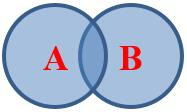

# 概率基础

## 概率的直观想法

古典概型属于是概率入门了，就是很容易进行直观理解的概率，典型的袋子里面拿球。但是呢，这个东西在大学数学里并不是重点，甚至一笔带过了，不是概率论里核心的主线的东西。

几何概型有点数学工具的东西在里面了。

真正使用函数工具表示概率才是主线内容，借助强大的微积分工具，可以从各个角度下手。

我个人认为概率是一个比较难思考的科目，定理公式的含义比线性代数还要难思考，一件挺复杂的事情用几个符号就代表出来了，高度精简，但是一个式子后面其实讲了很多事情。

我本科概率论和统计考试考了89分，然而过了两个星期全忘了，这全要得益于高度抽象，因为考试我像背单词一样背公式，应付一些概率计算和推理题是没有任何问题的。所以隔段时间就全忘了。再拿起来来看看又会做题了，过段时间又忘了。

## 事情之间的关系

这一块属于基础。对事件的抽象和描述，以及事情之间的关系。

- 包含

$$ A \subseteq B ,\ \ \ \ P(A) \le P(B) $$

A包含于B，B包含A，一个意思。需要注意的是，A发生必然导致B发生。

- 互斥

AB无相同样本点，则互斥。

$$ P(AB) = 0 $$

$$ P(AB) = P(A) + P(B) $$

互斥，互不相容。

- 对立

$$ P(AB)=0 $$，而且$$ P(AB)=P(A)+P(B)=1 $$。

性别一种对立事件。一个人，从生物学上讲不是男就是女，不可能即男又女，且必为男或女。

类似的例子：抛硬币。

$$A$$ 与 $$\bar A$$对立。

- 独立

$$P(AB) = P(A)P(B) $$ 

## 基本概率公式

此外有个全新的东西条件概率，以及衍生出来的贝叶斯乱七八糟

样本点$$ \omega $$，样本空间$$ \omega, \omega \in \Omega $$，随机事件是样本空间的子集、即事件A、B、C等。

事件的基本关系有**包含、相等、互斥**（或互不相容 $$ AB = \emptyset $$ ）**、对立**（$$ A和\bar{A} $$）。

事件的独立性P(AB)=P(A)P(B)，区别互斥。

要着重理解三个描述事件的概念：对立、互斥（互不相容）、独立。

互斥事件：我有个宠物，既是猫又是狗，不可能发生，互斥事件。

AB不能同时发生，那么就是互斥事件有$$P(AB)=0, P(AB)=P(A)+P(B) $$

AB能同时发生，非互斥事件。如果$$ P(AB)=P(A)P(B) $$那么独立，否则$$ P(AB)=P(A)P(B \mid A) $$

独立事件：我周末吃烧烤的概率是20%，喝可乐的概率是90%，一边吃烧烤一边和可乐的概率是5%，吃烧烤和喝可乐是互不影响的独立事件吗？0.2*0.9=0.18≠0.05。可能我吃烧烤的时候会喝啤酒，这两个事情互相有影响。如果我一边吃烧烤一边喝可乐的概率是0.18那么这两个就是独立事件，喝可乐不影响吃烧烤，吃烧烤不影响喝可乐。

AB是否可以同时发生？
是：非互斥事件。

古典概型不学数学也会遇到这类问题。

几何概型属于升级一点的

## 条件概率

## 全概率与贝叶斯

