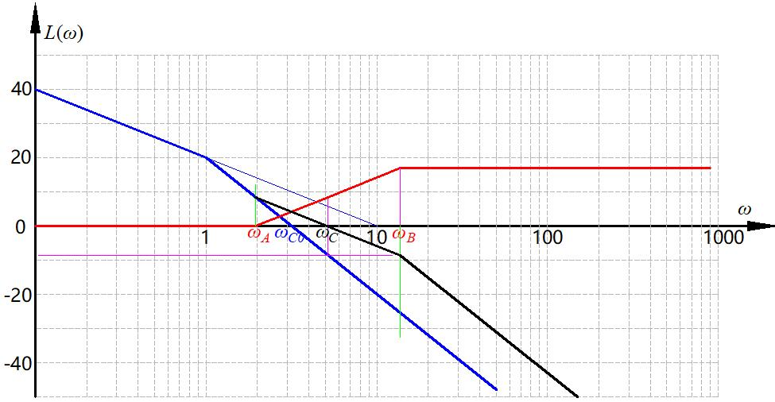

# 系统的综合校正


经典的分析方法都有了，拿到一个系统会看了。但是还不够，要会调整系统使得满足需求。

校正是精髓，前面都是分析系统的数学方法，这里才是真正应用数学方法去改造系统。

会改造系统，使得系统满足要求的性能，这才算完成了“控制”的这个目标。

校正方式：串联校正，反馈矫正，复合校正。

串联校正可以设计成超前、滞后、滞后——超前校正。

反馈校正典型的测速反馈。

复合校正，


## 串联校正

控制器的位置在被控对象前面，串在里面的。


这里的前后讲的是相角。

这个相角的前后和超调量的大小不太一样。超调量对于一些物理系统是可以看出来的，但是在频域里的两个指标，相角裕度和幅值裕度在阶跃响应里直接看看不出来。

虽然看不出来但是动态性能指标和频域指标是有关系的。即换算关系。

频域里的两个指标是频域里面的描述方式，得用信号通过系统通的思维去理解。三频段理论的指导思想要领会。或者说阶跃信号做三角级数展开，有了频域信息，这时候系统有点滤波器的感觉

频域里三频段理论：

开环系统对数幅频特性的低中高频区段，

低频段与积分环节和开环增益有关，反映了系统的稳态精度。

中频段大概就是截止频率附近的区段，反映系统动态性能和稳定性。从极端情况考虑，-20dB闭环接近一阶系统，-40dB接近二阶临界稳定系统，因此更希望中频段以20dB拉长了穿0dB线。

高频段基本就就认为是闭环高频段幅频特性了，反映系统对高频信号的抑制能力，设计的时候希望压低了。


在校正里有很多巧妙的方法。这里着重分析串联PID校正。工程上常用，但这里是非常猛的数学原理，不但有效果，这里还从数学上解释为啥是这个效果，非常猛。

### 超前校正


校正装置

$$ G(s) = \frac{aTs+1}{Ts+1} $$


超前网络使用的是他的相角超前特性，红点这个位置，在串联进系统里时，超前的相角叠加的同时，系统幅频渐近线会抬起一点点，进而导致截止频率稍稍增加，系统的相位裕度会降下一点点，在计算的时候要考虑这个事情，加个5~10°。


<center>
    
</center>

计算出校正网络需要提供的$$ \varphi_m $$，就可以知道校正网络的曲线高度。然后作图，截止频率就被动确定了。


系统设计举例：


比如说一个系统（飞机纵向控制、机械臂水平响应、啥都行，建模建出来）开环传递函数为

$$ G(s) = \frac{K}{s(s+1)} $$

增益一般很好调节的，可变电阻调调很简单。

这个系统有一些列的要求，最后落实到数学指标上

输入$$ r(t) = t $$时（可以认为是飞机匀速上升、机械臂水平运动），$$ e_{ss}^*\le0.1 $$，与理想位置的差距不能过大。此外$$ \omega_c \ge5, \gamma^* \ge 60°, h^* \ge 10 dB $$

确定一个串联校正装置$$ G_c(s) $$

增益很好确定，稳态误差可以确定增益，取得保守一点，K<10.设计矫正的时候，要贴这边设计，这个也是一种资源，这里用太多，其他地方就没得搞了。

画个校正前的对数幅频特性曲线

<center>
    
</center>


这时候口算一下，注意这图是渐进特性，这里用渐进算的
$$ \omega_{c0} = \sqrt{10} = 3.16 < \omega^* $$

但是相位裕度没有渐进这说法，用计算器算一下

$$ \gamma_0 = 180° + \varphi(\omega_{c0}) = 17.6° < \gamma^* $$


超前校正从图上来看，补一点相角，还拉高一点高频段的截止频率，所以，截止频率也不够、相位裕度也不够，那就整好了。


校正装置需要为这个系统贡献多少角度才能满足系统要求呢？

$$ \varphi_m = \gamma^* - \gamma_0 + (5°~10°) $$

前面很好理解，后面这多加的，理解成略微超过指标进行设计固然也没啥问题。究其本质，前面说了拉高了一点截止频率，因此新的截止频率比原来的截止频率靠后了，这几度是补截止频率靠后又下降的那些度数的。

$$ \varphi_m = 60° - 17.6° + 5° = 47.4° $$

校正装置的幅值

$$
\begin{array}{l}
    \left\{
        \begin{align}
            a = \frac{1+\sin{\varphi_m}}{ 1 - \sin{\varphi_m}} \\
            10\lg{a} = 8.5dB
        \end{align}
    \right.
\end{array}
$$

```warning
校正装置需要补偿的角度直接决定了装置的幅值。通过幅值可以确定一系列参数。这个公式记住就完事了。 

```

作图去确定剩下的参数

<center>
    
</center>

几何作图还是很简单的，计算略微复杂，难就难在线画多了以后还能不能找出几何关系去算各个点的频率。频率算出来了，各环节的数学表达也就出来了。

上面的图是用AutoCAD画的，不得不说，软件画图比尺子在纸上画要舒服太多了，画错了可以撤销，平移起来也很方便，而且相当精确。

可以直接从图上看出来超前校正的结果是抬高了高频段，闭环系统抗高频干扰的能力降低了。


### 滞后校正

利用滞后网络的幅值衰减特性挖掘系统自身的相角储备。

超前校正这么好但是也不是哪都能用的。

滞后网络用他压低幅频曲线的特性，同时要避免相角滞后的特性，所以用下图红点的位置，要和左面拉开10倍频程，同时校正装置的网络在这个点会有最大6°的相角滞后，在计算选择截止频率的时候要考虑到。

<center>
    
</center>


我们需要选定系统自身相角储备满足设计要求的截止频率，然后作图。校正网络幅频渐进线的高度是由被控系统决定的。


滞后校正：

系统设计举例：


一个系统开环传递函数为

$$ G(s) = \frac{K}{s(\frac{s}{5}+1)(\frac{s}{10}+1)} $$


要求，$$ K_{v}^*\ = 30 , \gamma^* \ge 40°, \omega_c^* \ge 2.3 $$


这个指标给的有点靠近做题了，居然直接给了个速度误差系数，那么口算一下K=30，画出来幅频特性渐进线。


<center>
    
</center>

可以算出来

$$ \omega_{c0} = 11.45 > 2.3 $$

$$ \gamma_0 = -25.28° < 40° $$

这截止频率比目标还大的很多。但是这相角根本就没有裕度，再用超前提高截止频率以后校正装置的那点度数根本不够用。这时候就出问题了。

滞后校正是我们主动压低截止频率，而超前校正是为了使用校正装置的相角而不得不拉高一点点幅值，增加一点截止频率。

超前校正没法用，这个系统对截止频率的要求不是很高，而且自己本身有相角储备，那就试着用校正装置压低截止频率，使用自己的的相角储备来满足相角裕度的要求。

这里要找到一个频率，使得校正后的相角裕度为。道理上讲画出来相频特性曲线作图就行，但是不好画，所以就试试，试出来这个点。

$$ \gamma_c(\omega_c) = \gamma^* +  6° = 46° $$

因为校正装置有滞后，所以会最多损失6°，这个6是给校正装置补偿的，只多不少。

区别于超前，加5~10跟着感觉加。

```warning
滞后网络，第二个转折频率后10dec处最大相角损失为6.

```

上来先看看再给定的截止频率处的裕度够不够要求的裕度，如果够，那么这个事情就是可以用滞后网络做成的。

经过尝试以后，截止频率$$ \omega_c = 2.7 $$这个地方满足设计要求。

设计的时候，截止频率靠右设计。

接下来就又是纯画图了。

```tip
这个思路其实可以和改变K联系起来看。

改变K再bode图上看是上下移动L，这使得截止频率变化，会有不同的相角裕度，这就是系统相角裕度的储备值。从时域理解，改变K会改变系统性能，相角裕度和性能的关系这就对上了。

但是呢改变K会使得低频段也变了，稳定精度也变了。因此我们需要改变截止频率，但是低频段还不压低，这就是滞后网络的作用。

但是思路还是改截止频率的思路。
```

<center>
    
</center>

校正这一块我感觉还是画图大于计算的，思想很重要，计算的话都是很简单的一次函数+三角形之类的几何问题，只不过是对数坐标。

图还是比公式好看。

最后验算一下。

看看这个图，也是很符合三频段理论的，-20db穿过0db线。


最后算出来这个校正装置

$$ G_c(s) = \frac{s/0.27 + 1}{s/0.0243 + 1} $$

虽然不好实现，但是也算是设计出来了。这里不好实现指的是，时间常数T=RC，$$ T=1/0.0243 = 41.152 $$

$$ t_s = 3T = 123.5 $$

也就是说上升时间是2.06分钟。


举例2

一个系统开环传递函数为

$$ G(s) = \frac{K}{s(s + 1)(\frac{s}{2} + 1)} $$


要求，静态速度误差$$ e_{ss}^* \le 0.1 , \gamma^* \ge 40°, 20\lg h^* \ge 10dB $$

算出来$$ K \ge 10 $$，取K=10

这个系统没有给出截止频率的要求，那就可以钻空子。算出来目前的相角裕度为$$ \gamma_0 = -33.4° $$这一看用超前绝对不行。

那么滞后，就找一个频率让裕度满足$$ \gamma = \gamma^* + 6° $$

试出来频率就在0.5~0.6之间。取0.55

<center>
    
</center>

设计出来的幅频特性曲线是这个样子。算出来各个转折频率，就有了校正环节传递函数

$$ G_c(s) = \frac{s/0.055 + 1}{s/0.003025 + 1} $$

这里说说为啥有$$ \omega $$要贴这边取。

惯性环节，时间常数的问题。截止频率往左10倍频是第一个转折点，再往左才是第二个转折点，转折频率过小，太难实现，兆欧级的电阻和微法级的电容属实不好搞。


至于K也要贴边，原因一样的。K大了幅频曲线抬高了，但是相角裕度储备点还在那个位置，在目标截止频率对称到0dB下面的时候，高度过高，转折频率靠的太左，还是一个工程上阻容网络实现的问题。


滞后校正还有个用法：**保持中频段不变，抬高低频段**。

比如一个产品的已经搞好了，传递函数给死了，要求中高频不动，但是稳定精度差了点，校正设计要求抬高低频段。

一个单位反馈系统$$ G_0(s) = \frac{0.53}{s(s+1)(s/2+1)} $$

设计要求是$$ K_v = K = 5 $$，中频段不变，以保持系统动态特性基本不变。使用串联校正装置。

要求K=5，则低频段校正装置提供的增益为$$ K_c = 9.43 $$

那么校正装置的幅频特性曲线高度为$$ 20\lg K_c = 19.5dB $$

转折频率要在截止频率左侧10倍频位置。


<center>
    
</center>

这个就是给校正网络加了个增益。核心思路图解。概念熟悉了以后，这是很自然而然的事情。

校正完了，算出来$$ \omega_1 = 0.00562, \omega_2=0.1\omega_c $$

$$ G_c(s) = \frac{9.434(18.868s+1)}{177.936s+1} $$

$$ G(s) = G_c(s)G_0(s) =  \frac{5(18.868s+1)}{s(s+1)(0.5s+1)(177.936s+1)} $$


当然毕竟串进去了东西，还是对相角有影响的，计算一下。

校正前$$ \gamma_0 = 47.3° $$

校正后$$ \gamma = 42.2° $$

有损失很正常，不到6°嘛。


根据频域指标和时域指标的换算公式

||$$ \sigma \% $$ | $$ t_s $$ | $$ e_{ss} $$ |
|-|-|-|-|
|原系统|30%|16.98|1.887|
|校正后|35%|19.81|0.2|

有的指标略有损失，但是稳定精度大大提高。

### 滞后-超前校正

前面两种情况适用的系统也很明朗了。


滞后超前网络的传递函数

$$ G_c(s) =  $$

<center>
    
</center>

照着图写吧，前面的传递函数还能背一背，这个不想背了。。

三个网络，一定要明确需要什么特性，要避免什么特性。

滞后-超前网络使用红点这个位置，幅值衰减特性和相角超前特性。同时要避免前面滞后部分的影响，因此滞后部分频率转折点要拉开我们用的那个点10倍频。

既挖掘自身的相角储备，网络本身又提供一部分相角。


在系统校正的时候到底怎么选择网络呢？线根据G-0(s)算截止频率和相角裕度，算完以后才知道到底该用哪个网络。

校正后的截止频率就选在校正装置相角最大点。

要拉起来的角$$ \varphi_m = (\gamma^* - \gamma_0(\omega_c^*)) + 6° $$

这个式子不能当公式记，得理解为啥这么算。这里是在算超前网络需要贡献的角度。超前网络的贡献是目标相角裕度减去校正后系统自身可以提供的相角储备，然后补偿滞后网络最大会损失的6°。

```tip
校正网络的幅值相角都是叠加关系，滞后-超前网络时一个滞后网络叠上另一个超前网络，所以两个特性都要充分的考虑。

这里没了5~10°这个说法了，因为这里算出来是准确的度数，不用估计。

自动控制原理里还需要注意的点是，什么时候是估计的大概，什么时候是准确数值。尤其是幅频特性里，大多数是渐进，相频特性大多数是准确。

```

校正举例：

一个单位反馈系统，开环传递函数

$$ G_0(s) = \frac{K}{s(s/10+1)(s/60+1)} $$

要求：

单位速度输入$$ e_{ss} \le 1/126 , \gamma^* \ge 35° , \omega_c^* \ge 20 $$

口算一下$$ K \ge 126 $$，就取K=126

<center>
    
</center>

算出来校正前的系统参数

$$ \omega_{c0} = \sqrt{126 \times 10} = 35.5 $$

$$ \gamma_0 = 180 - 90 -\arctan\frac{35.5}{10} - \arctan\frac{35.5}{60} = -14.9° $$

通过这两个参数判断使用什么校正装置。

对于超前，35+14.9+10 = 59.9°，不是很行。

对于滞后，在给定的最小截止频率处相角为

$$ \varphi(\omega_c^*) = 0-90-\arctan\frac{20}{10} - \arctan\frac{20}{60}$$

相角储备

$$ \gamma = 180 + \varphi(\omega_c^*) = 8.2° < \gamma^*$$

这超前网络提供的相角也不够，自身的储备也不够，那就用滞后超前，既利用自身的储备相角，超前网络提供一部分相角。

那么超前网络应该贡献出多少相角才能满足要求呢？

$$ \varphi_m = \gamma^* - \gamma(\omega_c) + 6° = 32.8° $$

这个度数很合理，用滞后超前网络是有可能办成的。


度数决定了网络高度，

$$ a = \frac{1+ \sin\varphi_m}{1- \sin\varphi_m} = 3.4 $$


那么网络的渐近线高度为

$$ 20\lg{a} = 10.64 dB$$

$$ \sqrt{a} $$

我们要用的那个点的高度为5.32dB，然后就是画图了。


<center>
    
</center>

画出图来，去用各种几何关系算出几个转折频率，就可以得到校正装置的数学表达式。

$$ 20(\lg\omega_4 - \lg\omega_c) = 5.32 $$

可以算出来$$ \omega_4 = 37 $$

$$ \omega_3 = \frac{\omega_c^2}{\omega_4} = 10.81 $$

$$ \omega_2 = \omega_c/10 = 2 $$

对于左半边曲线的高度，用$$ \omega_{c0} $$和$$ \omega_c $$的那个三角形来算

$$ (\lg\omega_{c0} - \lg\omega_c) \times 40 = 9.97dB $$

那么左半边高度$$ 9.97 + 5.32 = 15.29dB $$

$$ 15.29 = 20 \times ( \lg\omega_2 - \lg\omega_1 ) = 0.343 $$

当然不止这一种做法，用延长线全等也是可以做的。

```note
这部分其实核心思想不是计算，但是计算还挺多，不难但就是多。

计算的难度都是初中一次函数和全等的知识，认真一点算，没啥问题的。
```

关键的转折频率算出来了，那么校正装置的数学表达也就出来了。

$$ G_c(s) = \frac{(s/\omega_2+1)(s/\omega_2+1)}{(s/\omega_1+1)(s/\omega_4+1)} = \frac{(s/2 + 1)(s/10.18 + 1)}{(s/0.343 + 1)(s/37 + 1)} $$


校正后的系统也就有了

开环传函

$$ G(s) = G_c(s)G_0(s) = \frac{126(s/2 + 1)(s/10.18 + 1)}{s(s/10+1)(s/60+1)(s/0.343 + 1)(s/37 + 1)} $$


然后去验算一下各个指标，满足了就设计完事了，买电阻电容焊起来就是个校正网络，用运放网络也可以。


### 串联PID校正

串联PID控制器用运算放大器实现。

<center>
    
</center>

简单分析用传递函数描述这个运算放大器构成的电路

$$ G_c(s) = K_p + \frac{K_I}{s} + K_Ds $$

这就是万能的PID控制器，不懂原理也可以实现效果不错的控制器。


这个式子还可以写成标准的各环节串联的形式

$$ G_c(s) = \frac{K(T_1s+1)(T_2s+1)}{s} $$


可以看作是滞后-超前校正的特例。

但是这个最大可以拉起来90°。低频段-20，可以把系统型别提高一个档次。这是PID控制器的特点。


校正举例


$$ G_c(s) = \frac{K}{(s+1)(s/5+1)(s/30+1)} $$

设计一个PID控制器，要求

单位速度响应$$ e_{ss} \le 0.1 , \sigma\% \le 20 \%, t_s \le 0.5 $$

这是个0型系统，如果不校正，是跟不上这个输入的。

这个指标也是时域的，没关系换成频域的，

$$ K=10, \gamma^* \ge 65°, 、\omega_c^* \ge 13.6 $$


算一下$$ \omega_{c0} = 7.07 < \omega_c^* = 13.6 $$

$$ \gamma_0 = 30° $$

用超前的话，$$ \gamma(\omega_c^*) = 4.789° $$，这时候超前就不行了。且不说积分的问题。

那么滞后网络也不行，相角储备根本不够，且不说积分的事情，而且原理上也没法用滞后网络。

滞后-超前网络也不行，4.789+60°，还没算补偿，主要是积分的事情。

最后决定用PID。


```warning
算出来相角裕度和截止频率以后决定用什么校正网络。
```

截止频率要求13.6，这里就取成15了，取大一点，确定好截止频率以及校正装置的+20dB线。转折频率$$ \omega_2 $$怎么定呢？

用这半个超前网络和相位裕度计算，要拉起来的角

$$ \varphi_m = \gamma^* - \gamma(\omega_c) + 6° = 75.3° $$

这时候实际上又把PID环节拆开成两个一阶微分典型环节来处理了。

$$ \arctan\frac{\omega_c}{\omega_2} \varphi_m $$

反算出频率$$ \omega_2 = 3.9 $$

$$ \omega_1 $$的频率是由增益确定的-20dB的线和已经有的线相交决定的。对于这个系统，增益K在系统里考虑了，其实也可以放在校正装置里。

<center>
    
</center>

可以看出来，低频满足了，中频拉开了，高频也拉高了，抗高频干扰能力也下降了。

```tip
微分项对高频干扰不是很友好，微分会方法高频干扰。
```


频率法串联校正适用的范围：单位反馈的最小系统。

很严格，画图只画幅频特性不画相频，只有最小相角系统，幅频才能唯一确定开环传递函数。

至于为啥要单位反馈呢？不过不是单位反馈，闭环传递函数会引入零点，零点会改变系统性能。

但是呢，可以变通。非单位反馈系统，可以转换成单位反馈。

非最小相位系统也是可以的，要把幅频特性也画出来，综合稳定性一起考虑。反正是复杂了。

### 希望特性设计

分析和校正，分析是了解系统，校正是真正体现控制工程师能力的地方。除了前面的固定套路方法，还有个很灵活的设计方法，要求对各种概念都很理解。

常规设计是$$ G(s) = G_c(s)G_0(s) $$

希望特性是$$ G_c(s) = G(s)/G_0(s) $$

即直接按照三频段来调整系统，得出传递函数，放过来找这个串联校正装置。校正不是教条的东西，可以灵活的去操作。

举个例子

$$ G_0(s) = \frac{K}{ s( s/10 + 1 )( s/50 + 1 )( s/100 + 1 )( s/200 + 1 ) } $$

要求，*r = t*时，稳定误差小于*1/200*，超调量小于*30%*，调节时间小于0.7s

很容易换算为频域指标，K=200，\gamma > 47,\omega>13


<center>
    
</center>

黑线画出希望的频率特性，减一下就有红色的校正装置的特性曲线。处于方便电路实现的考虑，做适当的简化，品红线是简化后的。

<center>
    
</center>

剩下的就是简单的几何计算了，最后验算性能指标是否符合设计要求。

最后还可以再调整一下转折频率，在满足性能指标的要求下，尽量让转折频率大一点，这也是方便电路阻容网络实现的问题。

如果要求有比较好的抗高频干扰能力，那么可以把校正装置高频段再往下降几个db。

校正是个试凑过程。


## 反馈校正

时域分析用的比较多

测速反馈，前面简单说了一下。

削弱系统非线性的影响，提高响应速度，增加阻尼比。


