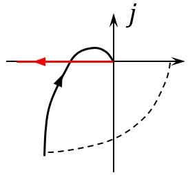
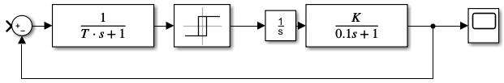

# 描述函数法

这也是个很有工程特点的精确的分析个大概的方法。

总的来说是基于频率分析的。

核心思想是，正弦信号作于于非线性环节的输出用一次谐波来近似。

用这个思想就可以得到非线性环节的频率特性，这就是描述函数，这时候非线性已经用一个线性系统代替了。可以使用各种频率分析方法进行分析，用于分析稳定性和自振，无法给出确切的时间响应。


## 描述函数

描述函数用来近似描述非线性环节的频率特性。

描述函数的功能和系统的频率特性是一样的。

如果一个非线性环节输入输出关系为$$ y = f(x) $$，输入$$ x(t)= A\sin{\omega t} $$

这时候有个乱七八糟的输出，不过没关系，谐波分析一下，展开

$$ 
y(t) = \frac{a_{0}}{2} + \sum_{n=1}^{\infty}(a_{n}\cos{n\omega t} + b_{n}\sin{n\omega t})
\\= \frac{a_{0}}{2} + \sum_{n=1}^{\infty}Y_{n}\sin({n\omega t} + \varphi_n)
$$

```note
傅里叶分析的数学原理可以参考前面内容[Fourier级数-微积分与级数论](..\..\part2\chapter1\10Fourier级数.md)
```

这是个精确的等于，接下来就是工程上分析个差不多就行的思想了。$$n>1$$时，高次谐波幅值都不大，就不管了，算个大概，工程嘛，大差不差就那么回事。

如果输出是奇函数，那么直流分量就是0，只要一次分量，可以认为

$$ y(t) \approx y_1(t) = a_{1}\cos{\omega t} + b_{1}\sin{\omega t} = Y_{1}\sin({\omega t} + \varphi_1) $$


描述函数定义为

$$ N(A)= \frac{Y_1}{A} \angle{\varphi_1} $$

实际上就是频率特性的定义，幅值比+相角差。这时候线性环节已经被我们线性化了，可以用各种频域手段如奈奎斯特等判断系统的稳定性了。


举个例子，理想继电特性

<center>
    
</center>

<center>
    
</center>

输出来的这个方波为

$$ y = \begin{array}{}
    \left\{
        \begin{align}
            -1 &, x \in (-0.5 ,0) \\
            1  &, x \in (0 ,0.5) \\
        \end{align}
    \right.
\end{array}
 $$

 这时候就要算基波了。

 奇函数，有直流分量为0，余弦分量为0，

 $$ b_1 = 2\int_{-0.5}^{0}-\sin \omega tdt + 2\int_{0}^{0.5}\sin \omega tdt = \frac{2}{\pi} $$

则

$$ f(t) = \frac{2}{\pi}\sin \omega t = \frac{2}{\pi}\angle0° $$

那么这个描述函数就定义为

$$ N(A) = \frac{\frac{2}{\pi}\angle0°}{A} = \frac{2}{\pi A}\angle0° $$


```tip
这个事情为什么可以这么做呢？前面说的工程大差不差是不严谨的，作为理论，哪怕真的和实际大差不差，这么说也是不严谨的。为了严谨要在理论上分析这么做的可行性，即要求数学推导上的几个近似在实际系统中要满足：

- 系统结构图可以化简成为一个非线性串一个线性。
- $$ N(A) $$奇对称，非线性输出信号是奇函数。
- 线性部分具有低通特性。这是“取一次谐波近似”的内在要求。

满足了这几个条件，才可以放心的说大差不差，这种近似是合理的。

```

## 典型环节的描述函数


这个可以数学推导，但是输公式太麻烦了。

核心是去理解傅里叶变换，用频谱分析的手段去处理信号，找出基波。

|非线性类型|静特性|$$ N(A)$$|
|-|-|-|
|理想继电特性|  |$$ N(A) = \frac{4M}{\pi A} $$|
|死区继电特性||$$ N(A) = \frac{4M}{\pi A}\sqrt{1- \left( \frac{h}{A} \right )^2 } $$|
|滞环继电特性||$$ N(A) = \frac{4M}{\pi A}\sqrt{1- \left( \frac{h}{A} \right )^2 } - j\frac{4Mh}{\pi A^2} $$|
|饱和限幅特性||$$ N(A) = \frac{4M}{\pi A}\sqrt{1- \left( \frac{h}{A} \right )^2 } - j\frac{4Mh}{\pi A^2} $$|

```tip
描述函数都是A的函数，与频率无关。

这个说法仅仅对理想的一般的奇对称而言的。如果含有储能元件，那就可能与频率有关了。

如果有双值，既输出值与速度有关系，那么描述函数有复数。
```

定义这个干啥呢？接着往下说


## 描述函数分析系统稳定性

再次指出描述函数是分析系统零输入下稳定性和自振的，不能给出时域响应。

<center>
    
</center>

$$ G(s) $$的极点都在左半平面，即最小相角系统，那么闭环系统的“频率特性”为

$$ \Phi(j\omega) = \frac{N(A)G(j\omega)}{1 + N(A)G(j\omega)} $$

闭环系统的特征式为

$$ \Delta = 1 + N(A)G(j\omega) = 0 $$

换一下形式

$$ N(A)G(j\omega) = -1 $$

如果都是线性的话，在频域法里面判定这个系统的稳定性，是画出$$ N(A)G(j\omega) $$的幅相曲线看看是否包围-1j0，如果包围那么就不稳定。

现在的问题是N(A)和\omega无关，是A的函数，为了描述的方便变一下形式

$$ G(j\omega) = - \frac{1}{N(A)} $$

我们把右边这个认为是广义的$$(-1,j0)$$点，这个想法太狠了。

如果把广义点包进去了，就不稳定。现在想想为啥用类似于频率特性的概念来定义非线性的描述函数，就是为了用频率特性分析的一些东西。

```tip
关于$$ (-1,j0) $$这个事情，回顾一下经典分析的奈奎斯特稳定性判据，将稳定性与这个点联系起来的思路也是很巧妙的。

[Nyquist频域稳定性判据](..\..\part4\chapter1\4频域分析.md#Nyquist频域稳定性判据)。
```

这个广义的这个东西，围起来不稳定，不围起来稳定，有交点，可以分析运动方向，看看是不是自振。

在交点$$ G(j\omega) = - \frac{1}{N(A)} $$是成立的，*x*通过$$ N(A)G(j\omega) $$后，模值没变，反相了，然而整个系统是负反馈啊，这就是自己满足自己了。如果稳定的话，这就是自振。

<center>
    
</center>

通过交点方程，可以算出自振幅值和频率。

这个广义的点首先是个点，他是会动的，画出来的线是运动可以到达的位置，A是输入的幅值。系统不稳定的意思是系统输出的幅值（实际上就是反相就是输入）越来越大，稳定的意思是输出的幅值变小，结合稳不稳导致与非线性环节的输出变化以及相信环节的幅相曲线，可以分析系统的稳定与自振情况。也就是说自振不一定稳定，还要具体分析。

<center>
    
</center>

对应于线性系统临界稳定的正弦波，非线性系统的临界稳定就是自振。

```tip
这个-1就是开环传递函数相位为-180°了。如果这时候幅值还大于1，那么是不是就是输入幅值拉伸后满足自己，幅值如果衰减的很低那么这个“反相叠加”的作用对系统的影响就越小，描述这个在-180°的时候幅值衰减的程度的词是幅值裕度，这就和前面的频率稳定性判据联系起来了。这里很直观的解释了为什么这么关注-180°这个位置。

同样的，也希望信号在经过系统后，幅值衰减到1之前，要避免反相自己叠加自己这个情况导致的系统不稳定，所以要远离-180°。

为啥幅值为1是个分界呢？从数学的角度来讲，隐隐约约觉得可能和级数收敛或者积分收敛有关系，后面再验证一下这个想法靠不靠谱。
```


举个很理论的例子

<center>
    
</center>

如果知道了这个系统输出量*c*的自振振幅为$$ A = 0.1 $$，自振频率$$ \omega = 10 $$

首先，这种不好分析，调整一下结构

<center>
    
</center>

非线性环节的描述函数为

$$ N(A) = \frac{4\sqrt{2}}{\pi A} $$

线性部分的传递函数为$$ G(s) = \frac{10K}{s(Ts+1)(0.1s+1)}  $$

画出来这两个曲线

<center>
    
</center>

根据图就可以定性分析是否有稳定的自振点了。这个系统一定会自振，不管初始条件的大小。

然后定量计算，因为最后稳定在交点上，所以一定满足自振条件

$$ N(A)G(j\omega) = -1 $$


$$ N(A)G(j\omega) = \frac{10K}{j\omega(j\omega T+1)(j0.1\omega+1)} = -1 $$

复数方程，写开来实部虚部分别列方程计算就可以了。

下面就是运算的问题了。

```tip
对于这种幅频特性为两个转折频率分三段的，一些参数其实可以当作小结论

$$  $$

```

最后用算出来的结果仿真一下，搭建一个仿真
<center>
    
</center>

这个东西因为是三阶的，所以可以在相空间离画出来相轨迹，稳定自振点是一个极限壳。对照二维极限环稳不稳的分析方法。

可以看出，果然是近似分析，虽然和实际有差距，但是已经很接近了。如果真要利用这个特性去搞一个比如说信号发生器，那么接下来就是调的事情了。

<center>
    
</center>


再举个例子，设计一个我需要的信号发生器

$$ \omega = 1,A = 4 $$


非线性环节的描述函数为

$$ N(A) = \frac{4\sqrt{2}}{\pi A} $$

线性部分的传递函数为$$ G(s) = \frac{Ke^{-\tau s}}{s(s + 1)(s + 2)}  $$

理想继电特性M=

调整K和\tau去调整信号的周期和幅值，总是能找到一个符合要求信号参数的组合的。


## 复杂系统和复杂非线性环节的处理

除了等效变换，还有个思路

决定系统稳定性的是闭环传递函数的特征方程。

那么暂且把非线性看作是线性的一个传递函数。用梅森增益公式，一下子就能找到传递函数，最重要的是找到了特征方程。

有点类似于等效开环传函，可以用数学手段化成*N(A)G(s) = -1*的形式，这就直接有了。

要注意的是，等效后的输出和原系统的输出会有一点点小差别，输入也不是原来的输入口了，但是整个系统不管在哪里频率都是一样的，那么原输出口的幅值其实也可以经过简单的频率特性算出来的。


对于复杂非线性环节的处理

两个非线性环节串联到一起。

把两个环节函数写出来，定义域值域写到一起，合成一个环节。数学上的手段，两个分段函数复合。

