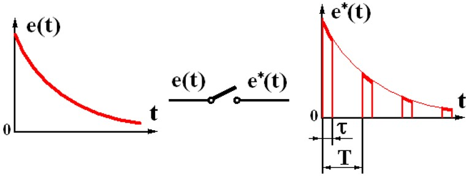
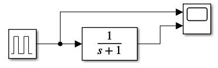
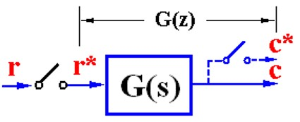
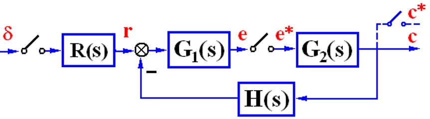

# 离散系统基础

理想采样函数联系起了连续信号和离散信号。

对于离散信号，我们用频谱分析得出采样后还原连续信号的条件，这就是香农定理。

然后我们再对采样连续信号进行拉普拉斯变换，进行的个代换起个名字叫*z*变换。


这个变换的地位再离散系统里个拉普拉斯的地位是一样的，提供了一个在复频域的视角。


## 离散系统和离散信号

离散系统指的是系统里面一处或几处是脉冲串或者数码。

离散系统有采样系统和数字系统。采样系统是实践离散但是数值连续，数字系统的数值也离散了，比如8bit只能表示0-255的整数，在值上也有量化误差。

用编程实现控制有相当多的好处，能程序实现各种算法，所有的控制器比如超前滞后啥的没有硬件电路了，全都用编程实现。此外还能联网，很强。

当然也有采样点间信息丢失的问题，和相同条件的连续系统相比，性能会有所下降（后面会用数学推）。此外还得要A/D以及D/A装置。

<center>
    
</center>

比如上面就是个书上举的例子。小口径高炮高精度伺服系统，最终是要控制转角，是个电机相关的控制系统。可以看出来比较老了，8255A作为IO口，可能控制计算机是8088这个时代的东西。

这个实际的系统大概画出来这这个样子的，这个框图不是数学上的框图，需要想办法用数学语言描述出来

<center>
    
</center>

最主要的，数字系统和连续系统里面不一样的，是AD和DA转换还有计算机控制过程，被控对象还是个连续的物理设备，如何用数学描述这些不一样的地方呢？

在数学上可以认为A/D过程是个理想采样过程，即采样是理想采样（瞬间完成），量化误差（字长足够）也忽略不计了。

$$ \tau << T, e^*(kT) = e(kT) $$

<center>
    
</center>

计算过程描述成**数码量**通过一个连续系统后再次采样。

比如实际系统，MCU输入为 `signed int error`，输出为`signed int u`，数学上MCU内部的算法计算仍为$$ G_c(s) $$，只不过后面又跟了个理想采样过程，相当合理。

<center>
    
</center>

D/A过程在数学上用ZOH(零阶保持器)来描述，把离散数值保持一拍，使得连续时刻每刻都有个值，虽然不光滑但是连续了。

接着MCU输出了`signed int u`，后面跟一块DA芯片，就描述成这个样子。

<center>
    
</center>


```note
现在常用的MCU比如，STM32或者NXP之类的，自带DAC模块了，这个过程实际上也是单片机里面内在的，比如说STM32，调用DAC_SetChannel1Data(DAC_Align_12b_R, vol);函数以后重新设置DAC的值，在此之前电压值就是上次设置的值。

实际上寄存器这个东西就是ZOH，只要不改变存储值，这个值一直即不会变。
```

将上面过程画成数学上的表达方式

<center>
    
</center>

信号采样序列$$ \delta_T(t) = \sum_{-\infty}^{+\infty} \delta(t - nT)$$，调幅信号是载波乘信号生成的，离散信号类似，单位脉冲序列乘时间域信号就是一串离散信号。

信号采样的数学表达$$ e^*(t) = e(t) \cdot \delta_T(t) = \sum_{0}^{+\infty} e(nT) \cdot \delta(t - nT) $$

这个误差采样的拉普拉斯变换

$$ E^*(s) = \mathscr{L} \left[ e^*(t) \right] = \mathscr{L} \left[ \sum_{0}^{+\infty} e(nT) \cdot \delta(t - nT) \right] = \sum_{0}^{+\infty} e(nT) \cdot e^{-nTs} $$

也就是说，e(nT) 延迟了nT出现了。即第n拍出来值为e(nT)这个值。

一个连续信号拉普拉斯变换是个s的有理式，离散化以后，拉普拉斯变换是个级数和，所以分析起来就不是很容易。


E*和E的区别有多大呢，将采样序列做傅里叶变换后带入进行拉普拉斯变换，可以知道关系
$$ E^*(s) = \frac{1}{T}\sum_{-\infty}^{+\infty} E( s + jn\omega_s) $$

区别于前面给出E\*与et在采样点上取值之间的关系，一般可以写成封闭形式。这个式子给出了E\*与E之间的关系，用于e*的频谱分析。

频谱是对信号而言，频率特性是对系统而言，对于一个给定的信号e(t)，非周期信号的频谱是连续的。采样后的离散信号的频谱可以用上面的关系，可以看出是连续频谱平移后叠加。

<center>
    
</center>

很重要的一个事情，采样频率必须足够快，才能不丢失连续信号的信息。这就是香农采样定理

$$ \omega_s > 2\omega_h $$

采样频率足够高后，找个理想滤波器，把高频的全部过滤掉，信号就可以一模一样的复现出来了，只不过幅值差了一点点。

<center>
    
</center>

<center>
    
</center>

很遗憾理想滤波器物理上不可实现，但是有个差不多的，找个容易实现又接近的。零阶保持器。

时域表达

$$ k(t) = 1(t) - 1(t-T) $$

$$ \color{red} { G_h(s) = \frac{1-e^{-Ts}}{s} } $$

$$ G_h(j\omega) = T\frac{\sin (\omega T/2)}{\omega T/2} e ^{-j\omega T/2} $$

表达式略微复杂了一点，但是幅相特性还是可以画的

<center>
    
</center>

希望的理想滤波器的幅频特性是蓝线，相频特性是0，然而实际的ZOH的特性是红线，所以即便是满足了香浓采样定理，也是没法完全一模一样复现的。但是还是要精确的看看影响

ZOH把离散信号变成阶梯信号，**粗略的看**，认为是加了一个*T/2*的纯延时环节，相角滞后了，稳定裕度损失了。所以ZOH对系统是有不利影响的。但是这点不利换来了巨大的其他便利。

<center>
    
</center>

```note
ZOH实际上不需要去实现，寄存器就是。而且可以严格证明，这个性能不算差，这个滞后效应比一阶二阶保持器都要小。
```

```note
采样后送进MCU，运算输出后，复现的问题。
```


**为什么可以离散**的问题


## 离散域分析的数学工具

前面出现过，$$ e^{Ts} = z $$，可以认为就是个简单的代换。

究其本质，这是个复函数，这个代换实际上是个映射。复函数$$ w = e^z $$代表的映射

<center>
    
</center>

把这里个离散表达的东西放到一起

$$
\begin{array}{}
    \left\{
        \begin{align}
            e^*(t) &= \sum_{0}^{+\infty} e(nT) \cdot \delta(t - nT)  \tag{1}\\
            E^*(s) &= \sum_{n=0}^{+\infty} e(nT) \cdot e^{-nTs} \tag{2}\\
            E(z) &= \sum_{n=0}^{+\infty} e(nT) \cdot z^{-n}  \tag{3}
        \end{align}
    \right.
\end{array}
$$

核心都是在表达幅值为e(nT)的这个脉冲延迟了n拍出现，这里的求和是把单个脉冲加成连续的序列，而不是一点上值相加。这三个意思是一样的。

Z变换仅仅对离散信号而言，但是写法有好多

$$ E(z) = \mathscr{Z} [e^*(t)] = \mathscr{Z} [E^*(s)]= \mathscr{Z} [E(s)] $$


z变换的数学方法：级数求和法、部分分式展开法、留数法。

级数求和根据上面式子（3），算一个无穷级数，这就是纯数学方法了，先导后积或者先积后导这些可能也要用的。

部分分式展开需要熟悉基本的几个变换

| $$ E(s) $$ | $$ e(t) $$ | $$ E(z) $$ |
|:-:|:-:|:-:|
| $$ 1 $$ | $$ \delta(t) $$ | $$ 1 $$ |
| $$ \frac{1}{s} $$ | $$ 1(t) $$ | $$ \frac{z}{z-1} $$ |
| $$ \frac{1}{s^2} $$ | $$ t $$ | $$ \frac{Tz}{(z-1)^2} $$ |
| $$ \frac{1}{s^3} $$ | $$ \frac{t^2}{2} $$ | $$ \frac{T^2z(z+1)}{(z-1)^3} $$ |
| $$ \frac{1}{s+a} $$ | $$ e^{-at} $$ | $$ \frac{z}{z-e^{-aT}} $$ |


同样的和拉普拉斯变换一样，也有一些Z变换的性质。最常用的，线性性质，位移定理。

最重要的，初值定理终值定理，这在连续系统里都有对应的东西，对照的看，工具性质的东西。连续系统的思想，离散的工具，具体的细节放在后面稳定稳态误差做对照。

还有个卷积定理。遇到了再说。


Z反变换：幂级数法（长除法）、部分分式展开法、留数法。

长除法最无脑，部分分式展开要记得除z，留数法最通用。

数学工具，z变换只局限在采样点去研究系统，这也是不得已而为之，和最后的连续的输出相比还是有差距。

举个例子说明一下，用窄脉冲去模拟脉冲序列直接作用于一个连续系统

<center>
    
</center>

蓝线是实际响应曲线，但是虚设采样开关后只反映了采样时刻的信息。后面还会说虚设开关这个事情。

<center>
    
</center>

## 离散系统的数学模型

接下来要真正的找出离散系统的模型。


### 差分方程

离散系统的时域数学模型：差分方程。

差分有个前向后向的问题，前向是往未来操作（前进），后向是往过去操作（后退）。
 
前向差分：

$$ \Delta e(k) = e(k+1) - e(k) $$

$$ \Delta^2 e(k) = \Delta e(k+1) - \Delta e(k) $$

后向差分：

$$ \nabla e(k) = e(k) - e(k-1)  $$

$$ \nabla^2 e(k) = \nabla e(k) - \nabla e(k-1)  $$

对比连续的微分

$$ \lim_{T \to 0} \frac{\Delta e(k)}{T} = \frac{de(t)}{dt} $$

相应的，差分方程有前向差分、后向差分，解法有迭代法、Z变换。

对于离散系统，解出差分方程自然也就有时域解了，系统的特性也就知道了。

### 脉冲传递函数

差分方程对应微分方程，相应的脉冲传递函数对应传递函数。脉冲传递函数定义为零条件输出z变换比输入z变换。

对于一个系统，有时候需要虚设一个开关，放弃部分输出信息，退一步用离散的方法还可以进行分析。

<center>
    
</center>

放弃一部分输出信息后使用z变换就可以得到离散数学模型，脉冲传递函数：

$$ G(z) = \frac{C(z)}{R(z)} $$

类比连续系统，也是单位脉冲响应的Z反变换。

同样的类比连续传递函数，这是个z的复函数，也由系统结构参数确定，等价于差分方程，同样可以画出z平面的零极点图。

当然脉冲传递函数也有局限性，无法反映系统响应的全部信息（仅采样点）；只适用单入单出、线性定常。


### 开环脉冲传递函数

由实际系统各模块画出控制框图以后，同样面临着找出脉冲传递函数的问题，由于由采样开关的问题，和连续系统还稍稍有点不一样。


- 环节之间有采样开关

<center>
    
</center>

$$ G(z) = \mathscr{Z}[G_1(s)] \cdot \mathscr{Z}[G_2(s)] $$

- 环节无开关的处理方法

<center>
    
</center>

$$ G(z) = \mathscr{Z}[G_1(s) \cdot G_2(s)] $$

- 有零阶保持器的处理

<center>
    
</center>

前面频率里推到过ZOH的传递函数，这里看看串联进去改怎么处理。把ZOH拆开来，可以看出虽然ZOH有积分环节但是并不增加系统阶数。

<center>
    
</center>


### 闭环脉冲传递函数

闭环系统脉冲传递函数，这是最后要用的东西。在这里Mason公式是有条件的。

再找闭环脉冲传递函数的时候，采样开关有时候需要等效，思想大概就是早晚都要采样，不如提前采样。

找闭环脉冲传递函数跟着信号流动方向硬推肯定是没问题的，虽然略微复杂。要注意前面一块Z变换还是分开Z变换的问题。

对于Mason公式，从数学方法的角度去考虑，改变字母并不会改变公式本质，所以每个环节前后都有采样开关或者等效采样开关的话，是可以直接用Mason公式的。

此外只有一个回路（无前馈通道），在前向通道至少存在一个一个实际采样开关的系统也可以小用一下。

<center>
    
</center>

这种系统采样开关没法透过G1，输入是连续，这种情况一般求不出脉冲传递函数，只能求出输出的z变换C(z)，但是只要输出的有了不影响分析，有个技巧，认为输入的r是单位脉冲激励的，开始的一瞬间给一下后面就没关系了。

<center>
    
</center>

这样的话就有

$$ \frac{C(z)}{1} = \frac{RG_1(z)G_2(z)}{1 + G_1G_2H(z)} $$


## 信号的分解

卷积的本质是信号的分解

基本信号及响应，信号的分解，

连续信号分解成$$ \delta(t) $$的线性组合，这样线性是不变系统就好搞了。


$$ f(t) = \int_{-\infty}^{+\infty} f(\tau)\delta(t-\tau)d\tau $$

这个积分是时间上加成一个序列，并非一个点上的数值相加。放在离散系统可能更好理解。

相当于把一个连续信号看作是一堆脉冲输入到系统里。

$$ \delta(t-\tau) $$的输出为$$ h(t-\tau) $$

那么总的输入$$ f(t) = \int_{-\infty}^{+\infty} f(\tau)\delta(t-\tau)d\tau $$的输出为

$$ y(t) = \int_{-\infty}^{+\infty} f(\tau)h(t-\tau)d\tau $$

这个式子叫成卷积积分，直接在时域里面得到了响应。

更数学的定义：

$$ f(t) = f_1(t)*f_2(t) = \int_{-\infty}^{+\infty} f_1(\tau)f_2(t-\tau)d\tau $$

卷积完还是个函数。纯时域的操作。

在复频域来看$$ Y(s) = G(s)R(S) $$


---

取样序列

$$ \delta(k) = 
\begin{array}{}
    \left\{
        \begin{align}
            = 1 , \ \ \ k=0\\
            = 0 , \ \ \ k \ne 0\\
        \end{align}
    \right.
\end{array} $$


$$ \delta_T(t) = \sum_{n=0}^\infty \delta(t-nT) $$

同样这个一串序列也是时间上把一个个脉冲加起来，不是说一个点把值加起来。

信号与系统里面有序列的分解。

任意离散序列$$ f(k) = \sum_{-\infty}^{+\infty} f(i)\delta(k - i) $$


