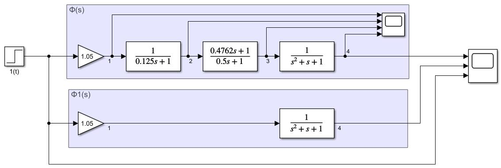

# 系统的时域分析

自动控制理论很大一部分时间在研究系统对信号的响应，很巧的是有一门电子类的课程是《信号与系统》。知道了系统对信号的响应规律以后，是不是可以通过一些手段调整改造系统，使得响应满足我们的要求，因此不止这一节的知识，后面的知识的展开逻辑：

系统对于一个信号能不能有稳定的响应输出？如果可以稳定，那么响应是不是又快又准？——系统分析

如果不稳，可不可以调整系统让其稳定？如果已经稳了，是不是可以让其更快更准？——系统校正

时域分析，就是直接解微分方程，我想知道输出信号是个什么样子，那么直接算出来$$ c(t) $$就完事了，稳不稳准不准就直接看出来了。但是也有问题，在分析系统参数改变导致系统性能变化的问题时，时域分析就不方便了。


## 时域分析大概的样子

时域分析举例。不仅仅是举例，更是两个非常重要的典型系统

### 一阶系统

在正式进入比较烦的数学内容之前，先来看看自动控制原理这门课在到底在干什么，有个直观感受。这里用一个简单的例子。

（一阶系统，随便拿几个）

一阶系统的数学形式：

$$ \Phi(s) = \frac{1}{Ts+1} $$

$$T$$时间常数，特征根$$ \lambda = -1/T $$

响应为

$$ C(s) = \Phi(s)R(s) $$

看看开关闭合后发什么什么事，（输入信号是阶跃）

首先，这个电容电压最后一定是不变。（稳定的）

其次，电压上升没有超过电源电压，上升的速度也还行。（无超调，动态性能）

最后，这个东西最后不变的这个值一定等于电源电压。（稳态误差为0）

思考：我能不能让这个东西反应变快？


交流电也挺常见的，给这个系统通个交流电，一看频率还是这个频率，输出电压和电流有点小区别。


这个简单的分析，基本上给出了自动控制原理要讨论的几个大问题：系统稳定性判断、动态性能分析、稳态性能分析、系统校正。

另一个角度，也可以认为是信号通过系统后的一个变化，不过着重于怎么让输出信号更接近输入信号。

95% 3T

信号积分求导的响应等于信号响应的积分求导。。。

```tip
这就涉及到信号的问题了。信号也是数学上对实际信号的理想化表达，虽然很数学但是很合理，还挺妙的，比如单位脉冲的定义。

单位脉冲、单位阶跃、单位斜坡、单位加速度。


还有个特殊的，正弦信号。用正弦信号分析又是个广阔的内容，在后面频域分析会甩开来聊，这里先不急。
```

### 二阶系统

复杂一点的要来了，二阶系统会去着重分析。


闭环标准形式

$$ \Phi(s) = \frac{\omega_n^2}{s^2 + 2\xi\omega_ns + \omega_n^2} $$

特征方程

$$ D(s) = s^2 + 2\xi\omega_ns + \omega_n^2 = 0 $$                          

二阶系统按照阻尼比分类有0阻尼、欠阻尼、临界阻尼、过阻尼。阻尼比不同，指标计算以及响应略有不同

特征根

| $$ \xi = 0 $$ | 0阻尼 | $$ \lambda_{1,2} = \pm j\omega_n $$ |
|-|-|-|-|
| $$ 0<\xi<1 $$ | 欠阻尼 | $$ \lambda_{1,2} = -\xi\omega_n \pm j\sqrt{1-\xi^2}\omega_n $$ |
| $$ \xi=1 $$ | 临界阻尼 | $$ \lambda_{1,2} = -\omega_n $$ |
| $$ \xi>1 $$ | 过阻尼 | $$ \lambda_{1,2} = -\xi\omega_n \pm \sqrt{\xi^2- 1}\omega_n $$ |


#### 过阻尼和临界阻尼
针对$$ \xi \ge 1 $$的情况。


#### 欠阻尼
要着重分析的情况。


对于阶跃响应，时域法要做的就是算出来时域表达

$$ C(s) = R(s)\Phi(s) = \frac{1}{s} \cdot \frac{\omega_n^2}{s^2 + 2\xi\omega_ns + \omega_n^2}  $$

做个反变换就出来了，然后整合起来

$$ c(t) = 1 - \frac{e^{-\xi \omega_n t}}{\sqrt{1-\xi^2}} \sin ( \omega_n \sqrt{1-\xi^2} t + \beta )  $$

对照特征方程的根

$$ s_{1,2} = -\xi\omega_n \pm j\sqrt{1-\xi^2}\omega_n = -\sigma \pm j \omega_d $$

$$ c(t) = 1 - \frac{e^{-\sigma t}}{\sqrt{1-\xi^2}} \sin ( \omega_d t + \beta )  $$

实部影响包络线收敛的速度，虚部引入震动，影响震动频率。

在考虑极点对输出的影响时，各个指标变动的根源就在这里。


```danger
说啥也得记的东西。注意这个公式只能用在二阶欠阻尼系统

$$
\begin{array}{l}
    \left\{
        \begin{align}
            t_p &= \frac{\pi}{\sqrt{1-\xi^2}\omega_n} \\
            \sigma \% &= e^{-\frac{\xi\pi}{\sqrt{1-\xi^2}}}  \\
            t_s &= \frac{3.5}{\xi \omega_n} \ \ \ \ \ (\Delta\% = 5\%)
        \end{align}
    \right.
\end{array}
$$
```

欠阻尼系统极点位置对响应的影响，极点位置与响应的关系


#### 二阶系统极点与响应关系

欠阻尼、过阻尼、零阻尼、负阻尼


```warning
一个很猛的思路：

信号与系统里的一个思路

极点对系统的影响，极点对系统有增强作用，极点越靠近虚轴，\omega在上升的时候，模值乘积会有个变小的过程，那么幅频特性取倒数就变大了，越靠近徐州越大。这个思路也很有意思，从幅频特性出发理解极点的作用的。

同样的，零点靠近虚轴的作用使得，幅频特性，模值乘积接近于0，抑制作用。

这个思路也很有意思。

[西电《信号与系统》郭宝龙](https://www.bilibili.com/video/BV1sU4y1L71P?p=157)

利用这个性质，可以设计低通、高通、带通、带组（陷波）滤波器

```
### 更高阶系统

实际情况，高阶系统也很常见。

极点对系统性能的影响，用二阶看。

高阶系统，找闭环主导极点，也用二阶大概看看。

一个高阶系统，写出来，响应也就定了。极点决定了响应的情况。极点决定响应模态，这是个纯数学上的关系，极点越靠近虚轴，衰减越慢，或者说时间常数越大。把一个系统看作是一堆典型环节串起来，那个时间常数最大的环节再后面，前面的过程很快，所以最慢的那个决定了系统的整体性能。

换个说法：离虚轴最近的极点对应的响应分量衰减最慢，再系统响应中起主导作用，如果其他极点又远离虚轴（时间常数很小），那么基本上这个系统的响应就是由闭环主导极点决定的。


举个例子：

$$ \Phi(s) = \frac{1.05(0.4762s + 1)}{(0.125s+1)(0.5s+1)(s^2 + s + 1)} $$

写成零极点形式：

$$ \Phi(s) = \frac{8(s + 2.1)}{(s+8)(s+2)(s^2 + s + 1)} $$

基于不同时间常数的电信环节串联的思路，搭建一个仿真，输入为阶跃信号

<center>
    
</center>

响应结果如下图，这个结果是复合上面的思路的，时间常数越小的环节响应越迅速。第二部分实际上是个零极点对消。

<center>
    
</center>

那么直接拿掉对消的环节和时间常数很小的环节，对比一下响应的差距

<center>
    
</center>

<center>
    
</center>

可以看到，这种思路是相当合理的，甚至可以使用二阶系统的那几个公式来近似估算一下高阶系统的一些动态性能。

也就是说

$$ \Phi(s) = \frac{1.05(0.4762s + 1)}{(0.125s+1)(0.5s+1)(s^2 + s + 1)} \approx \frac{1.05}{(s^2 + s + 1)} $$

从这个式子也可以看出使用闭环主导极点分析系统时传递函数的近似方法。


估计完了还是要考虑一下非主导极点的影响。

由于串入了一个时间常数比较小的环节，相当于阶跃信号变成了慢慢上升的阶跃信号，所以峰值时间变大了，响应变缓了，超调量也略微变小，借用二阶系统阻尼比的概念，就是非闭环主导极点增大了系统阻尼。（但要时刻记得控制理论里的阻尼比是在二阶系统定义的）。越靠近虚轴这个增加阻尼效果越明显，这也很好理解，因为前面的一阶环节时间常数大了。

## 系统的稳定性问题

闭环传递函数分母等于零的点影响系统的稳定性，也就是特征方程的解。极点都在复平面的左半平面，那么就是稳定的。(还得说说为啥)

直接解特征方程当然也是可以的，但是高阶的情况下可能不是很容易做到。因此有人就想了，能不能不解方程也可以去判断一下系统的稳定性。

这个方法居然还被找到了，这就是劳斯判据(Routh–Hurwitz stability criterion)。利用特征方程的系数，经过一系列标准化的操作，就可以判断s平面右侧有几个极点。

真正使用的话，当然还是MATLAB一个函数搞定。作为考试来讲，记住一套标准化的流程就行，这个东西证明起来还是挺复杂的，我也不会，作为学习的一环，先理解这个东西为什么存在然后怎么使用。

稳定是前提。


在这个判据里，有一种情况，出现全零行，在分析的时候会作为稳不稳的依据，但是在根轨迹里可以用这个特性判断闭环极点落在虚轴上的参数取值，从这点来考虑，出现全零行意味极点在虚轴，就是振荡了。

首先这个肯定不是大范围渐进稳定的，不是稳定到一个值的。但是呢也没有说指数发散，在不同的稳定语境下，对这种状态的描述略微有差异。

## 系统的动态性能

又快又好，超调又小。

这里要引出几个指标了。


## 系统的稳态误差

下面这个事情主要是想研究**纯积分环节**和**开环增益**对稳态误差的影响。先说个大概结论：PID控制里积分环节会消除稳态误差，增益大了也会减小稳态误差。

这个事情是先把开环传函的开环增益和积分环节拿出来作为一个部分放到闭环误差传递函数里面去看的，很巧的是，稳态误差正好就和这两有关系。（也有可能是有关系所以才单独拿出来，反正结论嘛，不巧就不能叫个结论。本来这个研究的问题，就是执果索因）


对于一个系统，开环传递函数为

$$ G(s)H(s) = \frac{K}{s^\nu} \cdot \frac{\prod \limits_{i=1}^m(\tau_is+1)}{\prod \limits_{j=1}^n(T_is+1)} = \frac{K}{s^\nu} \cdot G_0(s) $$

这个式子的意思是，一个开环传递函数，可以拆成积分环节，一堆零点一堆极点，再来个增益。

那么误差传递函数为

$$ \Phi_e(s) = \frac{1}{1 + G(s)H(s)} = \frac{1}{1+\frac{K}{s^\nu} \cdot G_0(s)} $$


稳态误差由终值定理

$$ e_{ss} = \lim_{s \to 0}sR(s)\Phi_e(s)= \lim_{s \to 0}\frac{sR(s)}{1+\frac{K}{s^\nu} \cdot G_0(s)} $$

这不巧了吗？$$ \lim_{s \to 0}G_0(s) = 1 $$


当输入为$$ r(t) = A \cdot 1(t) $$

$$ e_{ssp} = \lim_{s \to 0}s \cdot \frac{A}{s} \cdot \frac{1}{1+\frac{K}{s^\nu} \cdot G_0(s)} = \frac{A}{1+ \lim_{s\to 0}G(s)} = \frac{A}{1+K_p} $$

这里定义了个位置误差系数$$ K_p = \lim_{s \to 0}G(s) = \lim_{s \to 0}\frac{K}{s^\nu} $$


如果输入为$$ r(t) = A \cdot t $$

$$ e_{ssv} = \lim_{s \to 0}s\cdot \frac{A}{s^2} \cdot \frac{1}{1 + \frac{K}{s^\nu} \cdot G_0(s)} = \frac{A}{\lim_{s\to 0}sG(s)} $$


看起来东西这么多，实际上根源是终值定理，因为三个信号用的多，所以要定义一点控制理论特有的东西出来，不然全是数学的东西这让控制理论多没有面子。

其实这么搞的原因也是在于想直接用开环传递函数算稳态误差，跳过闭环这一步，定义的复杂是为了使用的简单。有了这个定义以后，拿到开环传递函数整整，就知道闭环稳态误差了，还是用开环分析闭环的思路。

这里的位置、速度、加速度讲的是输入信号。


## 系统的性能改善

### 二阶系统提高性能的两个方法

测速反馈，PD控制


这里使用时域的角度看这两种方法改善性能的机理。后面系统校正会有个大总结。

PD控制，是个串联校正装置。控制器为$$ 1+T_ds $$

很明显加了个零点，有零点的二阶系统，不改变自然频率$$\omega_n$$


测速反馈，增加阻尼比。


