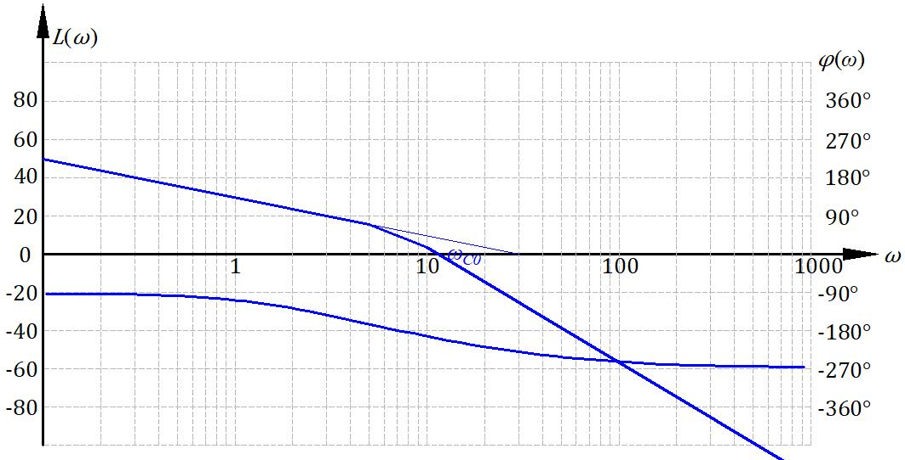
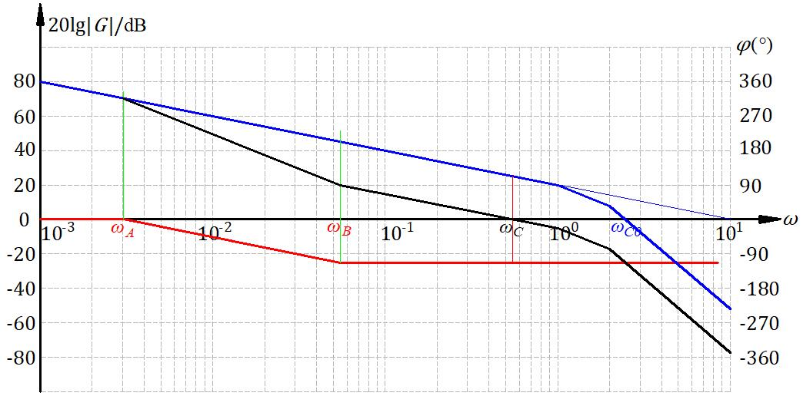
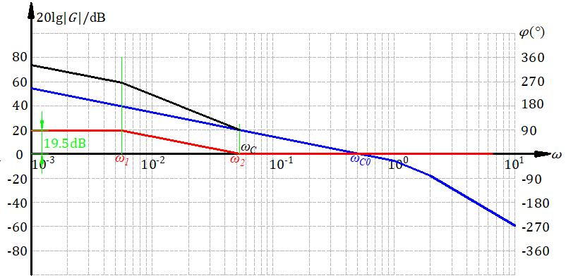

# 系统的综合校正

频域手段，相角超前、滞后、用图解法。


校正是精髓，前面都是分析系统的数学方法，这里才是真正应用数学方法去改造系统。

会改造系统，使得系统满足要求的性能，这才算完成了“控制”的这个目标。

校正方式：串联校正，反馈矫正，复合校正。


串联校正可以设计成超前、滞后、滞后——超前校正。

反馈校正典型的测速反馈。

复合校正，


## 反馈校正

测速反馈，前面简单说了一下。

削弱系统非线性的影响，提高响应速度，增加阻尼比。


## 串联校正

控制器的位置在被控对象前面，串在里面的。


这里的前后讲的是相角。

这个相角的前后和超调量的大小不太一样。超调量对于一些物理系统是可以看出来的，但是在频域里的两个指标，相角裕度和幅值裕度在阶跃响应里直接看看不出来。

虽然看不出来但是动态性能指标和频域指标是有关系的。即换算关系。

频域里的两个指标是频域里面的描述方式，得用信号通过系统通的思维去理解。三频段理论的指导思想要领会。或者说阶跃信号做三角级数展开，有了频域信息，这时候系统有点滤波器的感觉

频域里三频段理论：

开环系统对数幅频特性的低中高频区段，

低频段与积分环节和开环增益有关，反映了系统的稳态精度。

中频段大概就是截止频率附近的区段，反映系统动态性能和稳定性。从极端情况考虑，-20dB闭环接近一阶系统，-40dB接近二阶临界稳定系统，因此更希望中频段以20dB拉长了穿0dB线。

高频段基本就就认为是闭环高频段幅频特性了，反映系统对高频信号的抑制能力，设计的时候希望压低了。


在校正里有很多巧妙的方法。这里着重分析串联PID校正。工程上常用，但这里是非常猛的数学原理，不但有效果，这里还从数学上解释为啥是这个效果，非常猛。

### 超前校正


校正装置

$$ G(s) = \frac{aTs+1}{Ts+1} $$


系统设计举例：


比如说一个系统（飞机纵向控制、机械臂水平响应、啥都行，建模建出来）开环传递函数为

$$ G(s) = \frac{K}{s(s+1)} $$

增益一般很好调节的，可变电阻调调很简单。

这个系统有一些列的要求，最后落实到数学指标上

输入$$ r(t) = t $$时（可以认为是飞机匀速上升、机械臂水平运动），$$ e_{ss}^*\le0.1 $$，与理想位置的差距不能过大。此外$$ \omega_c \ge5, \gamma^* \ge 60°, h^* \ge 10 dB $$

确定一个串联校正装置$$ G_c(s) $$

增益很好确定，稳态误差可以确定增益，取得保守一点，K<10.设计矫正的时候，要贴这边设计，这个也是一种资源，这里用太多，其他地方就没得搞了。

画个校正前的对数幅频特性曲线

<center>
    
</center>


这时候口算一下，注意这图是渐进特性，这里用渐进算的
$$ \omega_{c0} = \sqrt{10} = 3.16 < \omega^* $$

但是相位裕度没有渐进这说法，用计算器算一下

$$ \gamma_0 = 180° + \varphi(\omega_{c0}) = 17.6° < \gamma^* $$


超前校正从图上来看，补一点相角，还拉高一点高频段的截止频率，所以，截止频率也不够、相位裕度也不够，那就整好了。


校正装置需要为这个系统贡献多少角度才能满足系统要求呢？

$$ \varphi_m = \gamma^* - \gamma_0 + (5°~10°) $$

前面很好理解，后面这多加的，理解成略微超过指标进行设计固然也没啥问题。究其本质，前面说了拉高了一点截止频率，因此新的截止频率比原来的截止频率靠后了，这几度是补截止频率靠后又下降的那些度数的。

$$ \varphi_m = 60° - 17.6° + 5° = 47.4° $$

校正装置的幅值

$$
\begin{array}{l}
    \left\{
        \begin{align}
            a = \frac{1+\sin{\varphi_m}}{ 1 - \sin{\varphi_m}} \\
            10\lg{a} = 8.5dB
        \end{align}
    \right.
\end{array}
$$


```warning
校正装置需要补偿的角度直接决定了装置的幅值。通过幅值可以确定一系列参数。这个公式记住就完事了。 

```

作图去确定剩下的参数

<center>
    
</center>

几何作图还是很简单的，计算略微复杂，难就难在线画多了以后还能不能找出几何关系去算各个点的频率。频率算出来了，各环节的数学表达也就出来了。

上面的图是用AutoCAD画的，不得不说，软件画图比尺子在纸上画要舒服太多了，画错了可以撤销，平移起来也很方便，而且相当精确。


可以直接从图上看出来超前校正的结果是抬高了高频段，闭环系统抗高频干扰的能力降低了。


### 滞后校正

利用滞后网络的幅值衰减特性挖掘系统自身的相角储备。

超前校正这么好但是也不是哪都能用的。

滞后校正：

系统设计举例：


一个系统开环传递函数为

$$ G(s) = \frac{K}{s(\frac{s}{5}+1)(\frac{s}{10}+1)} $$


要求，$$ K_{v}^*\ = 30 , \gamma^* \ge 40°, \omega_c^* \ge 2.3 $$


这个指标给的有点靠近做题了，居然直接给了个速度误差系数，那么口算一下K=30，画出来幅频特性渐进线。


<center>
    
</center>

可以算出来

$$ \omega_{c0} = 11.45 > 2.3 $$

$$ \gamma_0 = -25.28° < 40° $$

这截止频率比目标还大的很多。但是这相角根本就没有裕度，再用超前提高截止频率以后校正装置的那点度数根本不够用。这时候就出问题了。

滞后校正是我们主动压低截止频率，而超前校正是为了使用校正装置的相角而不得不拉高一点点幅值，增加一点截止频率。


超前校正没法用，这个系统对截止频率的要求不是很高，而且自己本身有相角储备，那就试着用校正装置压低截止频率，使用自己的的相角储备来满足相角裕度的要求。

这里要找到一个频率，使得校正后的相角裕度为。道理上讲画出来相频特性曲线作图就行，但是不好画，所以就试试，试出来这个点。

$$ \gamma_c(\omega_c) = \gamma^* +  6° = 46° $$


因为校正装置有滞后，所以会最多损失6°，这个6是给校正装置补偿的，只多不少。

区别于超前，加5~10跟着感觉加。

```warning
滞后网络，第二个转折频率后10dec处最大相角损失为6.

```

上来先看看再给定的截止频率处的裕度够不够要求的裕度，如果够，那么这个事情就是可以用滞后网络做成的。

经过尝试以后，截止频率$$ \omega_c = 2.7 $$这个地方满足设计要求。

设计的时候，截止频率靠右设计。

接下来就又是纯画图了。

```tip
这个思路其实可以和改变K联系起来看。

改变K再bode图上看是上下移动L，这使得截止频率变化，会有不同的相角裕度，这就是系统相角裕度的储备值。从时域理解，改变K会改变系统性能，相角裕度和性能的关系这就对上了。

但是呢改变K会使得低频段也变了，稳定精度也变了。因此我们需要改变截止频率，但是低频段还不压低，这就是滞后网络的作用。

但是思路还是改截止频率的思路。
```


<center>
    
</center>


校正这一块我感觉还是画图大于计算的，思想很重要，计算的话都是很简单的一次函数+三角形之类的几何问题，只不过是对数坐标。

图还是比公式好看。

最后验算一下。

看看这个图，也是很符合三频段理论的，-20db穿过0db线。


最后算出来这个校正装置

$$ G_c(s) = \frac{s/0.27 + 1}{s/0.0243 + 1} $$

虽然不好实现，但是也算是设计出来了。这里不好实现指的是，时间常数T=RC，$$ T=1/0.0243 = 41.152 $$

$$ t_s = 3T = 123.5 $$

也就是说上升时间是2.06分钟。


举例2

一个系统开环传递函数为

$$ G(s) = \frac{K}{s(s + 1)(\frac{s}{2} + 1)} $$


要求，静态速度误差$$ e_{ss}^* \le 0.1 , \gamma^* \ge 40°, 20\lg h^* \ge 10dB $$

算出来$$ K \ge 10 $$，取K=10

这个系统没有给出截止频率的要求，那就可以钻空子。算出来目前的相角裕度为$$ \gamma_0 = -33.4° $$这一看用超前绝对不行。

那么滞后，就找一个频率让裕度满足$$ \gamma = \gamma^* + 6° $$

试出来频率就在0.5~0.6之间。取0.55

<center>
    
</center>

设计出来的幅频特性曲线是这个样子。算出来各个转折频率，就有了校正环节传递函数

$$ G_c(s) = \frac{s/0.055 + 1}{s/0.003025 + 1} $$

这里说说为啥有$$ \omega $$要贴这边取。

惯性环节，时间常数的问题。截止频率往左10倍频是第一个转折点，再往左才是第二个转折点，转折频率过小，太难实现，兆欧级的电阻和微法级的电容属实不好搞。


至于K也要贴边，原因一样的。K大了幅频曲线抬高了，但是相角裕度储备点还在那个位置，在目标截止频率对称到0dB下面的时候，高度过高，转折频率靠的太左，还是一个工程上阻容网络实现的问题。


滞后校正还有个用法：**保持中频段不变，抬高低频段**。

比如一个产品的已经搞好了，传递函数给死了，要求中高频不动，但是稳定精度差了点，校正设计要求抬高低频段。

一个单位反馈系统$$ G_0(s) = \frac{0.53}{s(s+1)(s/2+1)} $$

设计要求是$$ K_v = K = 5 $$，中频段不变，以保持系统动态特性基本不变。使用串联校正装置。

要求K=5，则低频段校正装置提供的增益为$$ K_c = 9.43 $$

那么校正装置的幅频特性曲线高度为$$ 20\lg K_c = 19.5dB $$

转折频率要在截止频率左侧10倍频位置。


<center>
    
</center>

这个就是给校正网络加了个增益。核心思路图解。概念熟悉了以后，这是很自然而然的事情。

校正完了，算出来$$ \omega_1 = 0.00562, \omega_2=0.1\omega_c $$

$$ G_c(s) = \frac{9.434(18.868s+1)}{177.936s+1} $$

$$ G(s) = G_c(s)G_0(s) =  \frac{5(18.868s+1)}{s(s+1)(0.5s+1)(177.936s+1)} $$


当然毕竟串进去了东西，还是对相角有影响的，计算一下。

校正前$$ \gamma_0 = 47.3° $$

校正后$$ \gamma = 42.2° $$

有损失很正常，不到6°嘛。


根据频域指标和时域指标的换算公式

||$$ \sigma \% $$ | $$ t_s $$ | $$ e_{ss} $$ |
|-|-|-|-|
|原系统|30%|16.98|1.887|
|校正后|35%|19.81|0.2|

有的指标略有损失，但是稳定精度大大提高。

### 滞后-超前校正

前面两种情况适用的系统也很明朗了。


