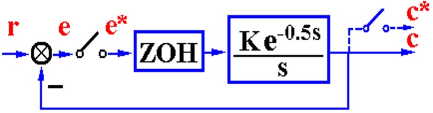

# 离散系统的分析

分析，即稳定性，稳态误差，动态性能。

## 稳定性

有了数学模型，又要执着的证明稳不稳了、什么情况下稳了。毕竟这是应用数学，不证明不专业，不像是个搞理论的。

前面简单的提了一下z变换表面上看是做了个代换$$ z = e^{Ts} $$

    

可以看出虚轴是映射到z平面单位圆了，稳定区域到单位圆里面了。

主带映射为整个z平面，满足采样频率的情况下，所有零极点都是落在主带里的。次要带就不管了。

这种映射有个小问题是，左半平面映射到单位圆里，数据密度过高，所有要求的计算精度比较高

当然还是要严格证明一下

$$ \Phi(z) = \sum_{j=1}^n \frac{ C_jz }{z - \beta_j}   $$

由稳定性的定义，单位脉冲响应的最终输出为0，也就是说$$ \Phi(z) = C(z) $$，要求$$ c(k) = 0 $$

$$ k \to \infty, c(k) = \sum_{j=1}^n C_j \beta_j^k = 0 $$

那么$$ \mid \beta_j \mid < 1 $$，也就是说，极点的模小于1.

定理是这么个定理，但是用起来不方便。为了使用的方便，做一个双线性变换把z平面映射w平面，使得判断方法和在z平面的判断方法一样。这时候就可以直接用s平面的劳斯判据了。劳斯判据再数学上是判断根的实部的位置，但是在控制理论里有了稳定这一层的含义。因此这个方法和字母没有关系，映射之后方法是通用的。

但是为啥s映射到z又映射到w呢，这个w和一开始的s啥关系呢？由多对一再到一对一映射，实际上相当于把s的主要带映射到整个w平面了。

双线性变换

$$
\begin{array}{}
    \left\{
        \begin{align}
            z &= \frac{w+1}{w-1}\\
            w &= \frac{z+1}{z-1}\\
        \end{align}
    \right.
\end{array}
$$

这个映射使得z平面的单位圆映射为w的虚轴。

这时候用Routh判据没有任何问题。

然后又有人觉得做个映射还不是很方便，能不能直接研究z平面的特征多项式，像劳斯判据一样直接用系数来判断根在不在单位圆里稳定性，这就有了朱利(Jurry)判据。

这反正也是个纯数学工具，就考试来讲记住用就完事了。

举个例子，忘记的时候回来复习（关键词：朱利判据例题）

$$ D(z) = -39 + 119z -117z^2 + 45z^3 = 0 $$

|Jurry| $$ z^0 $$ | $$ z^1 $$ | $$ z^2 $$ | $$ z^3 $$ |
|:-:|-|-|-|-|
|1| $$ -39 $$ | $$ 119 $$ | $$ -117 $$ | $$ 45 $$ |
|2| $$ 45 $$ | $$ -117 $$ | $$ 119 $$ | $$ -39 $$ |
|3| $$ b_0 $$ | $$ b_1 $$ | $$ b_2 $$ | |
|4| $$ b_2 $$ | $$ b_1 $$ | $$ b_0 $$ | |

$$ b_0 = \frac{}{} $$

除了双线性变换用Routh判据和直接用Jurry判据，还有个很经典的根轨迹。

根轨迹拿掉物理上的应用，从纯数学的角度讲就是分析根随参数的变化的。因此，同样是复数方程，自然也可以使用同样的方法画出根轨迹，只不过字母变成了z。

但是这里注意分析稳定性的时候，不再是复平面左半边了，是单位圆内部了。用几何方法算出来各种参数，基本的思路大概就是这样。

## 稳态误差

稳态误差也可以参考连续系统，基本思路是相同的，前面那么长的z变换数学铺垫，就是为了使用连续系统里相同的思路。

最很根本的是终值定理，误差传递函数来计算，后面的都是这个衍生出来的二级结论，这些也是从连续系统的思想里来的，不过用的是离散工具，把握住最根本的，后面的可以推出来的。

    

$$ GH(z) = \mathscr{Z}[G(s)H(s)] = \frac{1}{(z-1)^{\nu}}GH_0(z) $$

这里为啥积分环节变成了(*z-1*)，因为$$ z = e^{Ts} $$，映射关系。

$$ \lim_{z \to 1} GH_0(z) = K $$

这个也是从连续来的。这里甚至都没有写开，也不用写开。

那么误差脉冲传递函数

$$ \Phi_e(z) = \frac{1}{1 + GH(z)} $$

使用最根本的终值定理

$$ e(\infty) = \lim_{z \to 1}(z-1)\Phi_e(z)R(z) = \lim_{z \to 1}(z-1)\frac{1}{1 + GH(z)}R(z) $$

后面还是全部使用连续的思想，离散的工具

阶跃输入$$ R(z) = A\frac{z}{z-1} $$

$$ e_{ssp}(\infty) = \lim_{z \to 1}(z-1)\frac{z}{z-1}\frac{1}{1 + GH(z)} = \frac{1}{1 + \lim_{z \to 1}GH(z)} = \frac{1}{1+ K_p } $$

斜坡输入$$ R(z) = A\frac{Tz}{(z-1)^2} $$

$$ e_{ssv}(\infty) = \lim_{z \to 1}(z-1)\frac{ATz}{(z-1)^2}\frac{1}{1 + GH(z)} = \frac{AT}{\lim_{z \to 1}(z-1)GH(z)} = \frac{AT}{K_v } $$

加速度输入$$ R(z) = \frac{A}{2}\frac{T^2z(z+1)}{(z-1)^3} $$

$$ e_{ssa}(\infty) = \lim_{z \to 1}(z-1)\frac{A}{2}\frac{T^2z(z+1)}{(z-1)^3}\frac{1}{1 + GH(z)} = \frac{AT^2}{\lim_{z \to 1}(z-1)^2GH(z)} = \frac{AT^2}{K_a } $$

这几个系数和连续时一个意思，但是有一点不同的是，和采样周期也有关系了，这点很有意思。注意这个系统是一拍一拍脉冲直接冲击这个系统。

从这里也能看出一点点采样对系统的影响，采样周期越大，稳态误差越大。

为了说明这个“一拍一拍”冲击的含义，举个例子

    

输入为$$2t$$，讨论有无零阶保持器对系统的影响

没有ZOH就很简单了

$$ GH(z) = \frac{K(1-e^{-T})z}{(z-1)(z-e^{-T})} $$

$$ K_v = \lim_{z\to 1}(z-1)GH(z) = K $$

$$ e_{ss}(\infty) = \frac{AT}{K} $$

在连续系统里G(s)不论K大小都稳定，想象一下根轨迹。离散的系统稳定性后面说

有了ZOH

$$ G(z) = \mathscr{Z} \left[ \frac{1 - e^{-Ts}}{s} \cdot \frac{K}{s(s+1)} \right] =  $$

$$ K_v = \lim_{z\to 1}(z-1)GH(z) = KT $$

$$ e_{ss}(\infty) = \frac{A}{K} $$

可以看出，加了ZOH，稳态误差和连续系统是一样的。

再来说一下离散对稳定性的影响

    

先得找出开环脉冲传递函数，然后特征多项式，最后Jurry判据。

$$ G(z) =  $$

同样的，也有动态误差系数来看误差的稳态分量。

把误差脉冲传递函数进行幂级数分解，输入

## 动态性能

参考连续系统，典型二阶欠阻尼，极点对系统性能的影响。

$$ \Phi(z) = \frac{M(z)}{D(z)} = K^*\frac{\prod \limits_{i=1}^m(z-z_i)}{\prod \limits_{j=1}^n(z-p_j)} $$

研究极点对应的模态。写成上面这种形式，已经写成闭环形式了。在阶跃作用下来看这个系统的情况

$$ C(z) = K^*\frac{\prod \limits_{i=1}^m(z-z_i)}{\prod \limits_{j=1}^n(z-p_j)}\cdot \frac{z}{z-1}  = \frac{M(1)}{D(1)}\cdot \frac{z}{z-1} + \sum \frac{C_iz}{z-p_i} $$

前面一项是阶跃响应的稳态分量，前面那个是增益。后买你则是一堆极点的瞬态分量，模态对应的响应为

$$ c_i^*(t) = \mathscr{Z^{-1}} \left[ \frac{C_iz}{z-p_i} \right] $$

则$$ c_i(kT) = C_ip_i^k $$

这个就是单个模态，根据p很容易就能想象这个情况

在实轴上，模大于1，自然发散，小于1收敛。如果是负数，那么就是正负来回跳动，发散情况还是由模长决定

真要去分析的话，求系统脉冲传递函数，求C(z)，反变换，就可以确定各个指标了。

