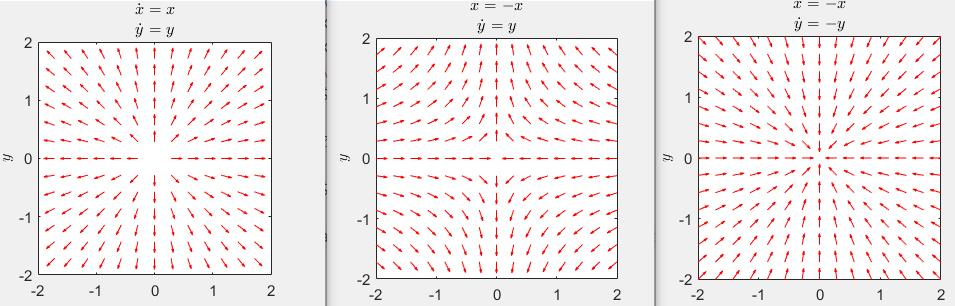
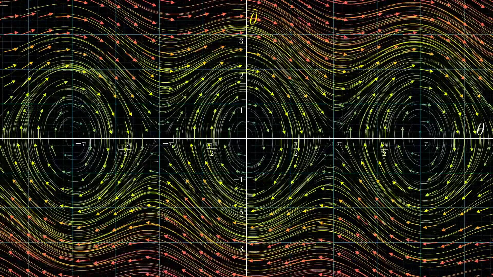
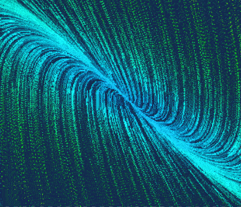
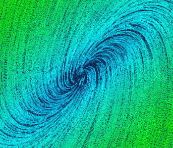

# 相平面法

（内容先写出来，但是顺序有些混乱，后面再优化逻辑顺序）

[3Blue1Brown微分方程概论](https://www.bilibili.com/video/BV1tb411G72z)

这个东西特别好。能一眼看出来系统的大概情况，我的网站这个笔记本的封面就是一个相轨迹图。

可惜的是这个方法只能用来看二阶系统，画出来是个二维图，当然理论上也可以把三阶系统画在相空间里，但是就不是很方便了。


画相图，一个是matlab的工具，全都能画，还有就是一个网站，能画动图，很炫酷。

[Field Play](https://anvaka.github.io/fieldplay/)

Phase Portrait

这个东西有些学校是数学系的课程，是分析微分方程解的一种方法。但是用在控制上，也比较好使。


画相平面图的时候微分方程和状态空间的转化

$$ \ddot{x} + a\dot{x} + bx = 0 $$

$$
\left [ \begin{array}{c}
\dot{x}       \\  
\ddot{x}       
\end{array} \right ] = 
\left [ \begin{array} {c}
0  & 1 \\  
b  & -a
\end{array} \right ]
\left [ \begin{array}{c}
x      \\  
\dot{x}     
\end{array} \right ]
$$

注意状态变量是怎么选的。

一个2d状态空间。

$$
\left [ \begin{array}{c}
\dot{x_1}       \\  
\dot{x_2}       
\end{array} \right ] = 
\left [ \begin{array} {c}
a  & b \\  
c  & d
\end{array} \right ]
\left [ \begin{array}{c}
x_1      \\  
x_2     
\end{array} \right ]
$$

找个特殊情况，b=c=0,u=0

$$ \dot{x}_1 = ax_1  , \dot{x}_2 = dx_2 $$

a>0,d>0

a>0,d<0

a<0,d<0

<center>
    
</center>

可以分析出前两个不稳定，第一个source源，第二个saddle鞍点，第三个是稳定的，sink，有点像洗手池蓄满水按起那个开关的感觉。

注意ad的符号，联系极点的关系。


对于一个更一般形式，abcd都不等0.

令一个$$ x=Py $$会有$$ \dot y = \Lambda y $$是不是又回到上面了。

而线性变换只是拉伸了形状而已。因此稳定性肯定是不变的。

对比一下拉伸后和拉伸前

<center>
    
    
</center>

这里画的是

$$
\left [ \begin{array}{c}
\dot{x_1}       \\  
\dot{x_2}       
\end{array} \right ] = 
\left [ \begin{array} {c}
-3  & 4 \\  
-2  & 3
\end{array} \right ]
\left [ \begin{array}{c}
x_1      \\  
x_2     
\end{array} \right ]
$$

极点为-1和1.对应上面第二种情况，可以很明显的看出相轨迹拉伸以后的形状。


对于特征值为为复数。（后面补充）
解出来状态方程，就会含有复数，可以搞成指数和三角函数的形式。

复数的虚部引入了sin和cos，实际上就是引入了振动。

## 再谈微分方程

微分方程用来描述**随着时间而变化的量**。运动状态天然就和时间分不开，因此微分方程被用来描述系统运动。


有了微分方程自然而然我们就会想去求解他。除了硬解，有没有更有趣的方法呢？

有的，但是不通用。物理系统有好大一部分是二阶微分方程，为啥要着重拎出来二阶呢？这里还不太好回答，先认为是一个前提，看完了再说为什么把这个方法局限在了二阶微分方程。


还是一个经典的例子，单摆。

前面讲了近似简谐运动，不幸的是这个是假的，因为做了无穷小近似。现在是时候看看真正的单摆是怎么运动得了，这部分我们会更加靠近真实世界，这也印证了前面说的“非线性才是世界的常态”。

一个更接近真实情况的单摆微分方程描述

$$ \ddot{\theta} = -\mu \dot{\theta} - \frac{g}{L}\sin\theta $$


很不错，一个典型的，二阶非线性微分方程，我们用个更一般的形式

$$ \ddot{x} + \dot{x} + \sin x = 0$$

如果这个方程很难求解，解不出来一个解析解，那一生气就不解了，我们直接尝试从方程出发理解和计算这个东西。

一种是计算机仿真可视化表达，也可以认为是仿真，就是直接观察这个单摆怎么运动的。图还是比数学表达式好看，因此有人发明了个抽象平面：相平面。用位置和速度描述运动，这两个量可以唯一确定系统的运动状态。$$ (\theta,\dot\theta) $$


<center>
    
</center>

```warning
如果有状态空间理论的基础，不难发现实际上这就是两个状态变量嘛，也就是说相空间是**二维的状态空间**，相轨迹是状态轨迹。

不直接用时间变量而用状态变量表示运动的方法就是相平面法。可以认为是状态空间方法的一种二维的特殊情况。

相平面实实在在的让我们直观的观察到了状态轨迹在状态空间的样子，遗憾的是后面的状态空间理论的高维空间没法这么操作，但是问题不大，思想一脉相传。

这个思想非常带劲，很妙。因此有些非线性系统用二维状态空间表达出来的时候，要能看得出来这是怎么回事。
```


相平面是个抽象平面，和物理空间完全不同，实际单摆的微分方程我们考虑了因为空气阻力而逐渐停止运动，这个和能量损耗联系起来，停止的原因是机械能消耗完了，换成控制理论的词，是不是可以说：某个东西在损耗即变化率（导数）小于0，再加上能量肯定大于0，那么最终消耗完了停止运动即稳定。这不就李雅普诺夫意义的稳定性判断条件嘛，只不过数学表达没这么粗暴。


这个图可以把微分方程可视化为向量场。实际上这一步已经把一个二阶微分方程搞成了两个一阶微分方程。把问题转化成了考虑高维向量的一阶导数问题。这是个很常见的思考方式。



这些轨迹代表了什么含义呢？一个抽象变化率，系统的运动状态。

更高的自由度会导致更高维度的状态空间，但是这些思想仍然是成立的。一个描述系统所有运动状态可能的空间。

用这种空间来描述动力学，是人类花了很久才找到的方法。尤其是规模非常大时。从中得到的不仅仅是一个初始状态下的运动，而是所有初始状态下的运动。并由此引申出控制理论中的稳定问题，注意这部分实际上一直再谈微分方程通用的数学方法。到稳定这里正好摸到控制的边缘了。这里也简单的说一下吧，立起来和最下面就是两个稳定点，直觉。


>《混沌：开创新科学》, （美）格雷克（Gleick,J.) 著,张淑誉 译,高等教育出版社


```note
上面基本上还是个了解核心思想的东西，加下来是要从量上分析深入这个东西。
```

## 相轨迹的性质


限于二阶非线性系统的分析。系统运行中$$(x,\dot{x})$$描绘出的轨迹，相轨迹。这实际上是个图解法。

- 相轨迹的斜率

相轨迹，时间是隐含在相轨迹里的。想看相轨迹的斜率，需要个简单的数学操作。如果反应不过来把x导数认为是y也可以，简单的初中一次函数问题。

对于一个非线性系统方程

$$ \ddot{x} + f(x,\dot{x}) = 0  \tag{1}$$ 

要时刻保持警惕这个求导是对谁求的。相平面$$ (x,\dot x) $$，相轨迹的斜率，用简单的数学操作

$$ \ddot{x} = \frac{d\dot{x}}{dt} = \frac{d\dot{x}}{dx} \cdot \frac{dx}{dt} = \frac{d\dot{x}}{dx}\cdot\dot{x} = -f(x,\dot{x}) $$


则相轨迹斜率

$$ \alpha = \frac{d\dot x}{dx} = -\frac{f(x,\dot{x})}{\dot x}  $$


这一串看起来挺吓人，但是实际上是因为都是x，从知识本身的角度讲，都是初中数学一次函数的东西，包括后面的**等倾斜线**画相轨迹。

- 相轨迹的奇点

实际上就是平衡点，平衡点指的是斜率不确定。

$$ \alpha = \frac{d\dot x}{dx} = -\frac{f(x,\dot{x})}{\dot x} = \frac{0}{0} $$

- 相轨迹的运动方向

上半平面，$$ \dot{x} > 0 $$向右运动，下面平面向左运动，也就说是顺时针。

通过横轴的时候，$$ \dot{x} = 0 $$

斜率

$$ \frac{d\dot x}{dx} = -\frac{f(x,\dot{x})}{\dot x} $$

要么无穷，垂直穿过x轴，否则为0，为稳定点。


## 画相轨迹

这个事情又是比较痛苦的事情。痛苦的根源在于MATLAB可以一下子实现这个事情，但是考试题会考手画这个东西。

有一类可以通过解微分方程求出相轨迹的解析表达式，注意这里的解微分方程是解的是以谁做为变量的微分方程。一般这种的相轨迹也简单基本上就是一次二次函数或者其他初等函数来回平移。

然而绝大多数是搞不出解析表达式的，那么就用一个类似描点作图但又有很大区别的等倾线法。等倾线上的相轨迹是等倾的。用这个方法画个大概。

先来看看解析法

$$ \ddot{x} + \omega_n^2x = 0 $$

这是个二阶的0阻尼系统。

$$ \ddot{x} = \dot{x}\frac{d\dot{x}}{dx} = - \omega_n^2x $$

这就直接解微分方程了

```java
vec2 get_velocity(vec2 p) {
  vec2 v = vec2(0., 0.);
  float a,b,c,d;

  a = 0.0;
  b = -3.0;
  c = 1.0;
  d = 0.0;
    
  v.x = a * p.x  + b * p.y;
  v.y = c * p.x  + d * p.y;
  
  return v;
}
```

实际画出来也确实是椭圆

<center>
    
</center>

遗憾的是，非线性系统一般不容易找到解析解。这时候就用等倾线法，描出来系统的大概相轨迹。等倾线上的相轨迹的斜率一样。

$$ \alpha = \frac{d\dot x}{dx} = -\frac{f(x,\dot{x})}{\dot x}  $$

核心是用这个表达式。

举个例子，系统方程为$$ \ddot{x} + \dot{x} + x = 0 $$


$$ \alpha = - \frac{\dot{x} + x}{\dot{x}} $$

有$$ \dot{x} = \frac{-x}{1+\alpha} $$

实际上这里的$$ \dot{x} $$就是$$ y $$，这条线上的相轨迹的斜率都是$$ \alpha $$

<center>
    
</center>

看这个图可以看出，不管在哪里，系统都是收敛的。只不过会波动一下。


那么有了相轨迹，怎么求时间解呢？

同一点的平均速度既可以用速度算，又可以用位置算，相轨迹是隐含时间的，取得越短越精确。


## 二阶系统的相轨迹

既然是非线性方法，为啥要画典型二阶系统的相轨迹呢？

后面会用到的。类似高阶系统用二阶近似分析，后面的飞线性也要线性化用这个二阶的图大概判断一下稳定点附近的情况。

二阶系统是可以用解析式表达出来相轨迹的，这是个很好的事情。


二阶系统要关注极点分布和奇点。

- 中心点，不稳定，简谐运动，两个极点在虚轴上

<center>
    
</center>

- 稳定的焦点，收敛的，极点在左半平面

<center>
    
</center>

- 两个负实根，过阻尼，稳定的节点

<center>
    
</center>

特征方程(s+1)(s+2)

这里有两个特殊的相轨迹，斜率和极点对应。收敛的很快，过阻尼二阶系统。

- 一正一负，鞍点，不稳定

<center>
    
</center>

特征方程(s+3)(s-2)

单调发散，

- 不稳定的焦点

特征方程(s^2-2s+2)

<center>
    
</center>

两个极点在虚轴右侧

- 不稳定的节点，

两个正根

<center>
    
</center>


## 非线性系统相平面分析

### 非本质非线性系统的分析

这里就要用到二阶相轨迹了。对于非线性的，我们可以找出平衡点，在平衡点进行近似线性化处理（这个经典工程思想见过好几十次了）。

线性化处理以后按照二阶系统分析奇点附近的稳定性，又是个大差不差的思想。


例如 系统方程$$ \ddot{x} + (3\dot{x}-0.5)\dot{x}+x+x^2 = 0 $$

求平衡点$$ x_e $$，判定平衡点附近的相轨迹性质

这个非线性体现在导数的平方项和x的平方项


在进行分析的时候，会有相轨迹最终到了一个环上的情况，起名极限环，稳定的极限环对应着系统的自振，可以直接观察到系统的周期运动。


