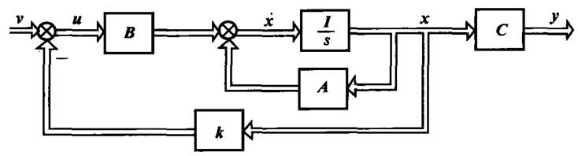

# 反馈控制

*10）正确理解利用状态反馈任意配置系统极点的有关概念，熟练掌握按系统指标要求确定状态反馈矩阵的方法；
*11）正确理解利用输出反馈任意配置系统极点的有关概念，掌握按系统指标要求确定输出反馈矩阵的方法；
12）正确理解分解定理，了解状态观测器的作用，一般了解全维状态观测器设计方法；

前面的准备工作终于做完了。这里要真正开始搞控制了。

闭环系统性能与闭环极点密切相关，经典控制理论用**调整开环增益**及引入**串联**和**反馈**校正装置来配置闭环极点，以改善系统性能。在状态空间的分析综合中，除了利用输出反馈以外，更主要的是利用状态反馈配置极点，它能提供更多的校正信息。然而不是所有的状态变量在物理上都可测量，因此，状态反馈与状态观测器的设计便构成了现代控制系统综合设计的主要内容。

从反馈信号的来源或引出点分，系统反馈主要有状态反馈和输出反馈两种基本形式；从反馈信号的作用点或注入点分，又有反馈至状态微分处和反馈至控制输入处两种基本形式。


前面判断完稳不稳，那么是不是可以改造一下系统，让不稳的系统在我的操作下变得稳定呢？实际上前面已经谈过一点点，把状态反馈回去看能不能把极点弄在负半平面。

首先有了系统的状态空间模型，把状态反馈回来。就有了个新的状态空间方程。新的系统矩阵和旧的不一样，新矩阵的特征值变了，这时候是不是我就可以尝试控制特征值了，系统可控是极点可以任意配置的前提条件。


## 状态反馈和极点配置

状态反馈可以到输入处和微分处。引入微分处可以任意配置极点，但是需要注入点，不是很好操作。反馈至输入处是和原有输入叠加后输入，好操作。

对于一个系统

$$
\begin{array}{}
    \left\{
        \begin{align}
            \boldsymbol{\dot{x}} &= \boldsymbol{Ax+bu} \\
            \boldsymbol{y} &= \boldsymbol{Cx}
        \end{align}
    \right.
\end{array}
$$

状态向量$$ \boldsymbol{x} $$通过状态反馈矩阵$$ \boldsymbol{k} $$，负反馈到控制输入端，有

$$ \boldsymbol{u=v-kx} $$ 

状态反馈大概就是这么个样子。这个状态反馈矩阵就是我们来设计的改善系统的东西。

<center>
    
</center>

这时候动态方程就变成了

$$
\begin{array}{}
    \left\{
        \begin{align}
            \boldsymbol{\dot{x}} &= \boldsymbol{Ax+b(v-kx)} = \boldsymbol{(A-bk)x + bv} \\
            \boldsymbol{y} &= \boldsymbol{Cx}
        \end{align}
    \right.
\end{array}
$$

可以看出改变了系统矩阵，这时候就有可能让不稳定的模态变得稳定了。

闭环特征多项式为$$ \mid \lambda\boldsymbol{I-(A-bk)}\mid $$。状态反馈改只变了系统矩阵及其特征值，其他的不变。


```tip
定理：状态反馈任意配置系统闭环极点的充要条件是系统可控。状态反馈不改变系统可控性。

这个定理实际上前面提过，但是没明显的提出来，一句话带过了。

（待证明）
```

一单输入线性定常系统的状态方程为：

$$
\dot{x} = 
\left [ \begin{array} \\
 0   & 0  & 0 \\  
 1   & -6 & 0 \\
 0   & 1  & -12 
\end{array} \right ]
x + 
\left [ \begin{array} \\
 1 \\  0 \\ 0  
\end{array} \right ]
u
$$

求个状态反馈向量k，使得系统闭环特征值为
$$ \lambda_1=-2， \lambda_{2，3}=-1 \pm j  $$ 

1. 判断可控
2. 待定系数


具体的计算过程是个考试侧重的东西，实际使用的时候，matlab有个函数的，一下子就算出来了。

## 输出反馈和极点配置

和状态反馈一样，输出反馈也可以反馈到输入或者微分处。输出反馈的优点是工程容易实现，因为输出量基本都是可测的。输出反馈至状态微分处，在工程上同样也难以实现，但是如果反馈至控制输入处，往往又不能任意配置系统的闭环极点。基本分析思路和前面是一样的，数学分析上有些小差别。


## 状态重构与状态观测器


在极点配置时，**状态反馈明显优于输出反馈**，但工程上不一定所有的状态变量可以测量﹔另一方面，输出量一般是可测量的，然而输出反馈至状态微分处，在工程上同样也难以实现，但是如果反馈至控制输入处，往往又不能任意配置系统的闭环极点。

于是，一种很猛的方法出现了，将这两种反馈方案结合起来，利用系统的输出，通过状态观测器重构系统的状态，然后将状态估计值（计算机内存变量）反馈至控制输入处来配置系统极点的方案。

当重构状态向量的维数与系统状态的维数相同时，观测器称为全维状态观测器，否则称为降维观测器。显然，状态观测器可以使状态反馈真正得以实现。基本上可以认为实际系统都是用状态观测器实现状态反馈的。

这个这个估计的值和真实的值一样吗？一开始的状态值都不知道，这怎么估计呢？那应该是大差不差的，这个问题交给搞理论的证明一下，发现是数学上严格可以证明没有任何问题的。

有一个实际的系统在物理世界运行，然后还有个模拟的系统在计算机里跑着。

输入量同时输入到两个系统里，比较一下输出量，输出没有误差以后，可以不加证明的猜测，估计的状态变量值就等于实际的状态的值。当然证明了以后发现确实等于。


设系统动态方程

$$
\begin{array}{}
    \left\{
        \begin{align}
            \boldsymbol{\dot{x}} &= \boldsymbol{Ax+Bu} \\
            \boldsymbol{y} &= \boldsymbol{Cx}
        \end{align}
    \right.
\end{array}
$$

计算机里面跑的系统
$$
\begin{array}{}
    \left\{
        \begin{align}
            \boldsymbol{\dot{\hat{x}}} &= \boldsymbol{A\hat{x}+Bu} \\
            \boldsymbol{\hat{y}} &= \boldsymbol{C\hat{x}}
        \end{align}
    \right.
\end{array}
$$

既然实际状态变量测不到，那么初值自然也不知道。模拟系统输出和真实系统输出也有差别。这时候有差别那就再来个反馈控制，用输出的偏差来消除输出的偏差，这样状态的偏差也逐渐就没有了。

观测器的输出反馈目的是配置观测器极点，提高观测器动态性能，使状态偏差趋向于零。


接下来设计状态观测器。

全维状态观测器动态方程为

$$
\begin{array}{}
    \left\{
        \begin{align}
            \boldsymbol{\dot{\hat{x}}} &= \boldsymbol{A\hat{x}+Bu} - \boldsymbol{H(\hat{y}-y)}\\
            \boldsymbol{\hat{y}} &= \boldsymbol{C\hat{x}}
        \end{align}
    \right.
\end{array}
$$

有

$$ \boldsymbol{\dot{\hat{x}}} = \boldsymbol{(A-HC)\hat{x}+Bu + Hy} $$

状态误差的状态方程

$$ \boldsymbol{\dot{x} - \dot{\hat{x}}} = \boldsymbol{(A-HC)(x - \hat{x}}) $$

即

$$ \boldsymbol{\dot{e}_x} = \boldsymbol{(A-HC)e_x} $$

也就是说，建立观测器就是在建立一个新的反馈系统，使得状态的误差趋近于0.

实际选择H矩阵时，要防止反馈失真，通常希望观测器响应速度比状态反馈系统的响应速度快3~10倍。


分离定理：若受控系统S(A,B,C)可控、可观测，则用状态观测器估计值形成状态反馈时，系统的极点和观测器极点课分别独立进行。即K与H的设计课分别独立进行。

## 降维状态观测器

当状态变量部分可直接用传感器测量，一部分不行，可以用降维状态观测器。

## LQR控制器


前面有了状态反馈控制了，来看一个问题，如何确定特征值即极点呢？做题倒是题目给出了极点，但是实际使用的时候什么样的极点是好的？


在优化理论中，引入cost function的概念，来帮助选择反馈增益k。

$$ \min{J} = \int_0^\infty (\boldsymbol{x^TQx + u^TRu})dt $$

在满足系统稳定的时候找一个满足代价函数的最小值，

